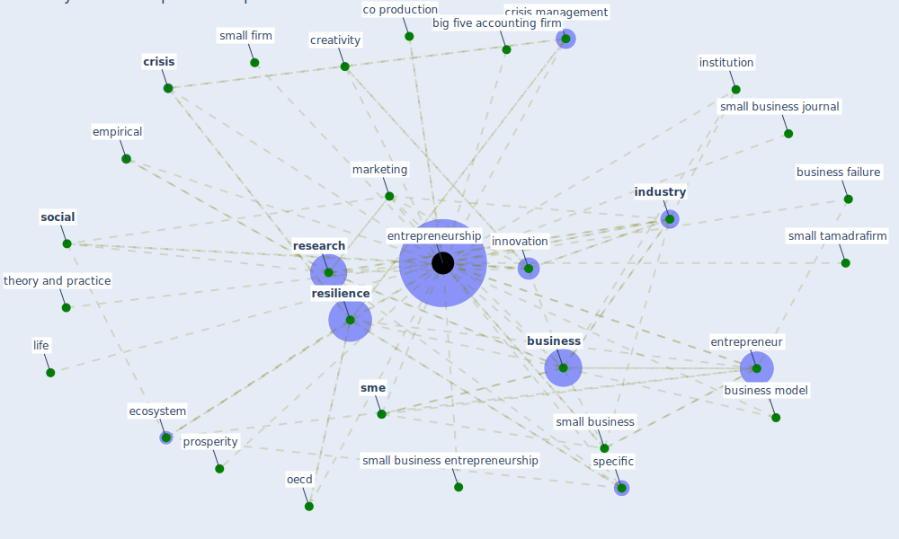

# Keyword: entrepreneurship

## Keywords

 * big five accounting firm, [business](keyword_business), business failure, business model, business venture insight, co production, [covid-19](keyword_covid-19), creativity, [crisis](keyword_crisis), crisis management, culture, [ecosystem](keyword_ecosystem), emerge economy, empirical, [entrepreneur](keyword_entrepreneur), entrepreneur culture, [entrepreneurship](keyword_entrepreneurship), failure, fund, [industry](keyword_industry), [innovation](keyword_innovation), institution, life, [marketing](keyword_marketing), [oecd](keyword_oecd), prosperity, [research](keyword_research), [resilience](keyword_resilience), small business, small business entrepreneurship, small business journal, small firm, small tamadrafirm, [sme](keyword_sme), [social](keyword_social), specific, theory and practice

## Mapping

## Neighbours

### Closest articles

* <scp>COVID</scp>             ‐19: Small and medium enterprises challenges and responses with creativity, innovation, and entrepreneurship - [LINK](article_thukral_covid19_2021)
* Startups in times of crisis – A rapid response to the COVID-19 pandemic - [LINK](article_kuckertz_startups_2020)
* Covid-19 and asset management in EU: a preliminary assessment of performance and investment styles - [LINK](article_rizvi_covid-19_2020)
* How COVID-19 Could Accelerate the Adoption of New Retail Technologies and Enhance the (E-)Servicescape - [LINK](article_willems_how_2021)
* COVID-19 and regional solutions for mitigating the risk of SME finance in selected ASEAN member states - [LINK](article_taghizadeh-hesary_covid-19_2022)
* COVID-19 risks and systemic gaps in Nigeria: resilience building lessons for pandemic and climate change management - [LINK](article_lawal_covid-19_2022)
* The socio-economic implications of the coronavirus pandemic (COVID-19): A review - [LINK](article_nicola_socio-economic_2020)
* Contextualizing the Covid-19 pandemic for a carbon-constrained world: Insights for sustainability transitions, energy justice, and research methodology - [LINK](article_sovacool_contextualizing_2020)
* Proximity and post-COVID-19 urban development: Reflections from Milan, Italy - [LINK](article_tricarico_proximity_2021)
* Blockchain technology and its applications to combat COVID-19 pandemic - [LINK](article_sharma_blockchain_2022)

### Closest BPs

