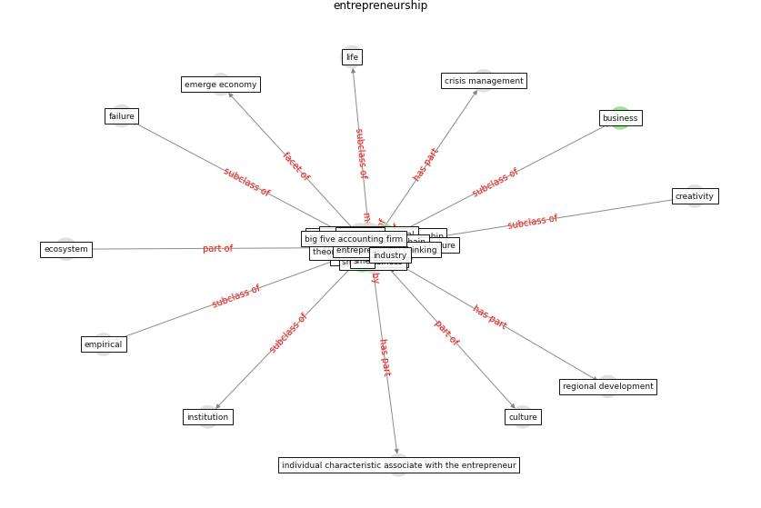

# Keyword: __entrepreneurship__
## Clusters

* Cluster 9: [resilience-infrastructure](cluster_9.md)

## Concepts

 

## Articles
* COVID19: Small and medium enterprises challenges and
responses with creativity, innovation, and
entrepreneurship ([thukral_covid19_2021](article_thukral_covid19_2021.md))
* Startups in times of crisis – A rapid response to the
COVID-19 pandemic ([kuckertz_startups_2020](article_kuckertz_startups_2020.md))
* Startups in times of crisis – A rapid response to the
COVID-19 pandemic ([kuckertz_startups_2020](article_kuckertz_startups_2020.md))
* Startups in times of crisis – A rapid response to the
COVID-19 pandemic ([kuckertz_startups_2020](article_kuckertz_startups_2020.md))
* unesco_case_2021-100 ([unesco_case_2021-100](article_unesco_case_2021-100.md))
* Blockchain technology and its applications to combat
COVID-19 pandemic ([sharma_blockchain_2022](article_sharma_blockchain_2022.md))
* Startups in times of crisis – A rapid response to the
COVID-19 pandemic ([kuckertz_startups_2020](article_kuckertz_startups_2020.md))
* realdania_refleksioner_2022_EN-1100 ([realdania_refleksioner_2022_EN-1100](article_realdania_refleksioner_2022_EN-1100.md))
* realdania_refleksioner_2022_EN-1150 ([realdania_refleksioner_2022_EN-1150](article_realdania_refleksioner_2022_EN-1150.md))
* realdania_refleksioner_2022_EN-1050 ([realdania_refleksioner_2022_EN-1050](article_realdania_refleksioner_2022_EN-1050.md))
