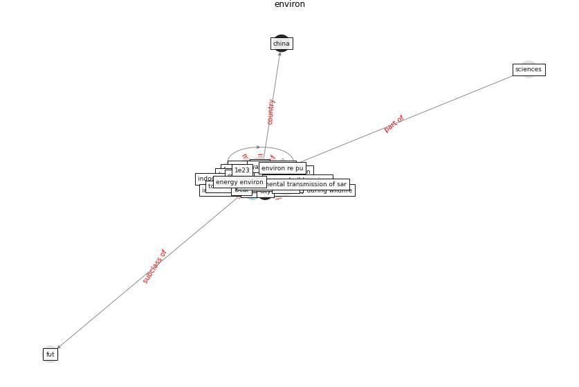

# Keyword: __environ__
## Clusters

* Cluster 12: [wastewater-sars](cluster_12.md)

## Concepts

 

## Articles
* A Review on Building Design as a Biomedical
System for Preventing COVID-19 Pandemic ([amran_review_2022](article_amran_review_2022.md))
* afrin_covid-19_2021 ([afrin_covid-19_2021](article_afrin_covid-19_2021.md))
* COVID-19 Higher Mortality in Chinese Regions
With Chronic Exposure to Lower Air Quality ([pansini_covid-19_2021](article_pansini_covid-19_2021.md))
* Prophylactic Architecture: Formulating the Concept
of Pandemic-Resilient Homes ([elrayies_prophylactic_2022](article_elrayies_prophylactic_2022.md))
* Psychological Effects of Home Confinement and
Social Distancing Derived from COVID-19 in the
General Population—A Systematic Review ([rodriguez-fernandez_psychological_2021](article_rodriguez-fernandez_psychological_2021.md))
* The Effect of Opening Windows on Air Change
Rates in Two Homes ([howard-reed_effect_2002](article_howard-reed_effect_2002.md))
* Designing Post COVID-19 Buildings: Approaches for
Achieving Healthy Buildings ([navaratnam_designing_2022](article_navaratnam_designing_2022.md))
* Prophylactic Architecture: Formulating the Concept
of Pandemic-Resilient Homes ([elrayies_prophylactic_2022](article_elrayies_prophylactic_2022.md))
* Disinfection technology of hospital wastes and wastewater:
Suggestions for disinfection strategy during coronavirus
Disease 2019 (COVID-19) pandemic in China ([wang_disinfection_2020](article_wang_disinfection_2020.md))
* A Continuously Active Antimicrobial Coating
effective against Human Coronavirus 229E ([ikner_continuously_2020](article_ikner_continuously_2020.md))
