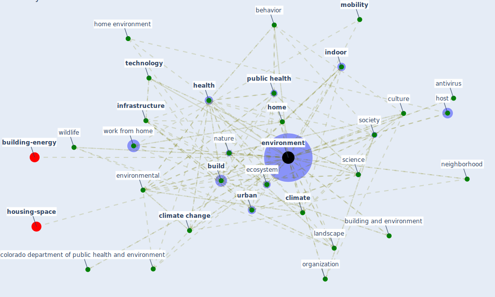

# Keyword: environment

* [space-housing](cluster_3)

* [building-design](cluster_4)

* [design-ventilation](cluster_5)

* [obesity-county](cluster_9)

* [iaq-system](cluster_12)

## Keywords

 * Cluster_12, animal, antivirus, atmospheric, background point, behavior, [biodiversity](keyword_biodiversity), [build](keyword_build), building and environment, [climate](keyword_climate), [climate change](keyword_climate_change), colorado department of public health and environment, [community](keyword_community), [computer](keyword_computer), [covid-19](keyword_covid-19), culture, daily live, [dwell](keyword_dwell), ecography, ecological, ecology, [ecosystem](keyword_ecosystem), [environment](keyword_environment), [environmental](keyword_environmental), [europe](keyword_europe), frontiers inecology and the environment, geography, [green space](keyword_green_space), hand hygiene, [health](keyword_health), healthy space, [home](keyword_home), home environment, host, [human health](keyword_human_health), hygiene, [indoor](keyword_indoor), [infrastructure](keyword_infrastructure), landscape, life on earth, [lockdown](keyword_lockdown), [microorganism](keyword_microorganism), [mobility](keyword_mobility), [natural](keyword_natural), [nature](keyword_nature), [neighborhood](keyword_neighborhood), [office](keyword_office), [organization](keyword_organization), [pandemic](keyword_pandemic), paragon, [physical](keyword_physical), [plan](keyword_plan), politic, [pollutant](keyword_pollutant), [pollution](keyword_pollution), protection, [public health](keyword_public_health), [public space](keyword_public_space), renewable energy, [residential](keyword_residential), resilient economy, sanitary, savanna, science, scientific community, sensitive area, servicescape, [sewage](keyword_sewage), [simulation](keyword_simulation), [society](keyword_society), soil, [sound](keyword_sound), [stress](keyword_stress), surround, [sustainability](keyword_sustainability), [sustainable](keyword_sustainable), [sustainable development](keyword_sustainable_development), [technology](keyword_technology), thermal, [time](keyword_time), [tourism](keyword_tourism), [transportation](keyword_transportation), [united nations](keyword_united_nations), united nations environment programme, [urban](keyword_urban), urban area, [urban planning](keyword_urban_planning), urban system, urbanization, vulnerable, vulnerable we be, [wastewater](keyword_wastewater), weather, weather beijing, who, [wildlife](keyword_wildlife), [work](keyword_work), work from home, worker productivity, workflow

## Mapping

## Neighbours

### Closest articles

* Continuous IEQ monitoring system: Context and development - [LINK](article_parkinson_continuous_2019)
* How COVID-19 Could Accelerate the Adoption of New Retail Technologies and Enhance the (E-)Servicescape - [LINK](article_willems_how_2021)
* A review of facilities management interventions to mitigate respiratory infections in existing buildings - [LINK](article_zhang_review_2022)
* Methods for air cleaning and protection of building occupants from airborne pathogens - [LINK](article_bolashikov_methods_2009)
* Green infrastructure through the lens of “One Health”: A systematic review and integrative framework uncovering synergies and trade-offs between mental health and wildlife support in cities - [LINK](article_felappi_green_2020)
* Characterization and performance evaluation of a full-scale activated carbon-based dynamic botanical air filtration system for improving indoor air quality - [LINK](article_wang_characterization_2011)
* Antivirus-built environment: Lessons learned from Covid-19 pandemic - [LINK](article_megahed_antivirus-built_2020)
* ASHRAE Position Document on Infectious Aerosols - [LINK](article_ashrae_ashrae_2022)
* Review and comparison of HVAC operation guidelines in different countries during the COVID-19 pandemic - [LINK](article_guo_review_2021)
* Prophylactic Architecture: Formulating the Concept of Pandemic-Resilient Homes - [LINK](article_elrayies_prophylactic_2022)

### Closest BPs

