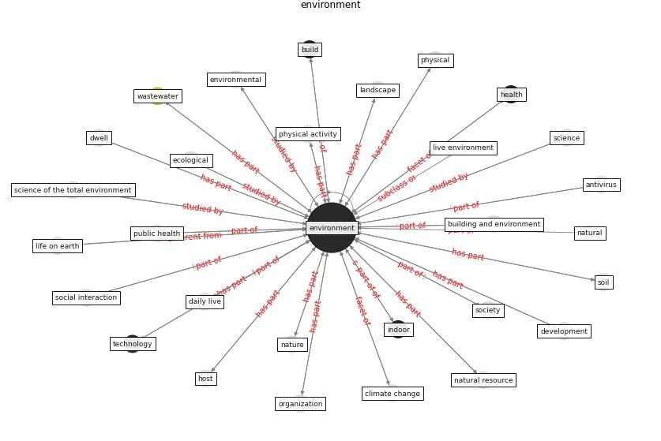

# Keyword: __environment__
## Clusters

* Cluster 10: [building-health](cluster_10)
* Cluster 13: [space-urban](cluster_13)

## Concepts

 

## Top 10 articles for __environment__
* Continuous IEQ monitoring system: Context and
development ([parkinson_continuous_2019](article_parkinson_continuous_2019))
* How COVID-19 Could Accelerate the Adoption of
New Retail Technologies and Enhance the
(E-)Servicescape ([willems_how_2021](article_willems_how_2021))
* Antivirus-built environment: Lessons learned from
Covid-19 pandemic ([megahed_antivirus-built_2020](article_megahed_antivirus-built_2020))
* A review of facilities management interventions to
mitigate respiratory infections in existing buildings ([zhang_review_2022](article_zhang_review_2022))
* Methods for air cleaning and protection of building
occupants from airborne pathogens ([bolashikov_methods_2009](article_bolashikov_methods_2009))
* Characterization and performance evaluation of a
full-scale activated carbon-based dynamic botanical air
filtration system for improving indoor air quality ([wang_characterization_2011](article_wang_characterization_2011))
* Prophylactic Architecture: Formulating the Concept
of Pandemic-Resilient Homes ([elrayies_prophylactic_2022](article_elrayies_prophylactic_2022))
* Review and comparison of HVAC operation guidelines in
different countries during the COVID-19 pandemic ([guo_review_2021](article_guo_review_2021))
* ashrae_ashrae_2022 ([ashrae_ashrae_2022](article_ashrae_ashrae_2022))
* Presence of SARS-Coronavirus-2 RNA in Sewage and
Correlation with Reported COVID-19 Prevalence in
the Early Stage of the Epidemic in The
Netherlands ([medema_presence_2020](article_medema_presence_2020))
