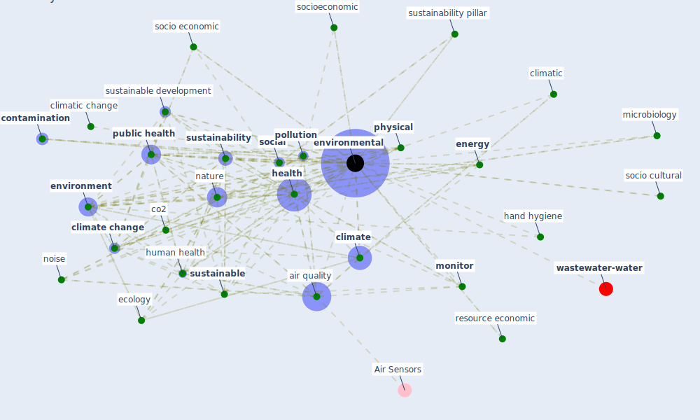

# Keyword: environmental

* [wastewater-water](cluster_0)

## Keywords

 * Cluster_0, air quality, ambient, approach, asian country, behavioral, [breeam](keyword_breeam), [build](keyword_build), carbon, chamber test, [climate](keyword_climate), [climate change](keyword_climate_change), climatic, climatic change, climatic determinants, climatic profile, climaticconditions, [clinical](keyword_clinical), co2, [construction](keyword_construction), [contamination](keyword_contamination), [coronavirus](keyword_coronavirus), [covid 19 crisis](keyword_covid_19_crisis), cultural, dimension, eco efficiency, ecology, [economic](keyword_economic), economic benefit, [ecosystem](keyword_ecosystem), [efficiency](keyword_efficiency), [energy](keyword_energy), [engineering](keyword_engineering), [environment](keyword_environment), [environmental](keyword_environmental), field, [green](keyword_green), [green building](keyword_green_building), greenhouse gas, hand hygiene, hazardous, [health](keyword_health), health building, health consequence, health outcome, health protection agency, [human health](keyword_human_health), hygiene, indigenous, [infectious disease](keyword_infectious_disease), integrate approach, intervention, low emission, manmade, meteorological, microbiology, [mitigation](keyword_mitigation), [monitor](keyword_monitor), [nature](keyword_nature), net zero emission, [noise](keyword_noise), [physical](keyword_physical), plastic waste, [pollution](keyword_pollution), pollution level, pollution level will not be long last, preventative measure, problem cause by covid 19, [productivity](keyword_productivity), [public health](keyword_public_health), public interest, ratification, resilience to the pandemic, resource economic, sea, [sleep](keyword_sleep), [social](keyword_social), socio cultural, socio demographic factor, socio economic, socioeconomic, solid waste management, spatial, [surveillance](keyword_surveillance), [sustainability](keyword_sustainability), sustainability issue, sustainability pillar, [sustainable](keyword_sustainable), [sustainable development](keyword_sustainable_development), sustainable technology, swab, waste, water distribution, [world bank](keyword_world_bank)

## Mapping

## Neighbours

### Closest articles

* Addressing vulnerability, building resilience: community-based adaptation to vector-borne diseases in the context of global change - [LINK](article_bardosh_addressing_2017)
* How COVID-19 Could Accelerate the Adoption of New Retail Technologies and Enhance the (E-)Servicescape - [LINK](article_willems_how_2021)
* Prototype Early Warning Systems for Vector-Borne Diseases in Europe - [LINK](article_semenza_prototype_2015)
* Navigating Climate Change: Rethinking the Role of Buildings - [LINK](article_cole_navigating_2020)
* COVID-19 and Green Housing: A Review of Relevant Literature - [LINK](article_kaklauskas_covid-19_2021)
* COVID-19 Could Leverage a Sustainable Built Environment - [LINK](article_pinheiro_covid-19_2020)
* Mapping research in logistics and supply chain management during COVID-19 pandemic - [LINK](article_montoya-torres_mapping_2021)
* Addressing the impact of COVID-19 lockdown on energy use in municipal buildings: A case study in Florianópolis, Brazil - [LINK](article_geraldi_addressing_2021)
* Occupant health in buildings: Impact of the COVID-19 pandemic on the opinions of building professionals and implications on research - [LINK](article_awada_occupant_2022)
* Ten questions concerning occupant health in buildings during normal operations and extreme events including the COVID-19 pandemic - [LINK](article_awada_ten_2021)

### Closest BPs

