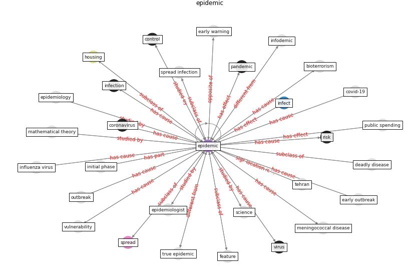

# Keyword: __epidemic__
## Clusters

* Cluster 3: [city-spatial](cluster_3)

## Concepts

 

## Top 10 articles for __epidemic__
* martin_impact_2008 ([martin_impact_2008](article_martin_impact_2008))
* Prophylactic Architecture: Formulating the Concept
of Pandemic-Resilient Homes ([elrayies_prophylactic_2022](article_elrayies_prophylactic_2022))
* Understanding the role of urban design in disease
spreading ([brizuela_understanding_2019](article_brizuela_understanding_2019))
* RUDDS_bioRxiv_update ([RUDDS_bioRxiv_update](article_RUDDS_bioRxiv_update))
* A Review on Building Design as a Biomedical
System for Preventing COVID-19 Pandemic ([amran_review_2022](article_amran_review_2022))
* realdania_refleksioner_2022_EN ([realdania_refleksioner_2022_EN](article_realdania_refleksioner_2022_EN))
* afrin_covid-19_2021 ([afrin_covid-19_2021](article_afrin_covid-19_2021))
* Questioning the use of the balcony in apartments during
the COVID-19 pandemic process ([aydin_questioning_2020](article_aydin_questioning_2020))
* Mitigation strategies and compliance in the COVID-19
fight; how much compliance is enough? ([mukerjee_mitigation_2021](article_mukerjee_mitigation_2021))
* Epidemics, Planning and the City: A Special
Issue of Planning Perspectives ([davis_epidemics_2022](article_davis_epidemics_2022))
