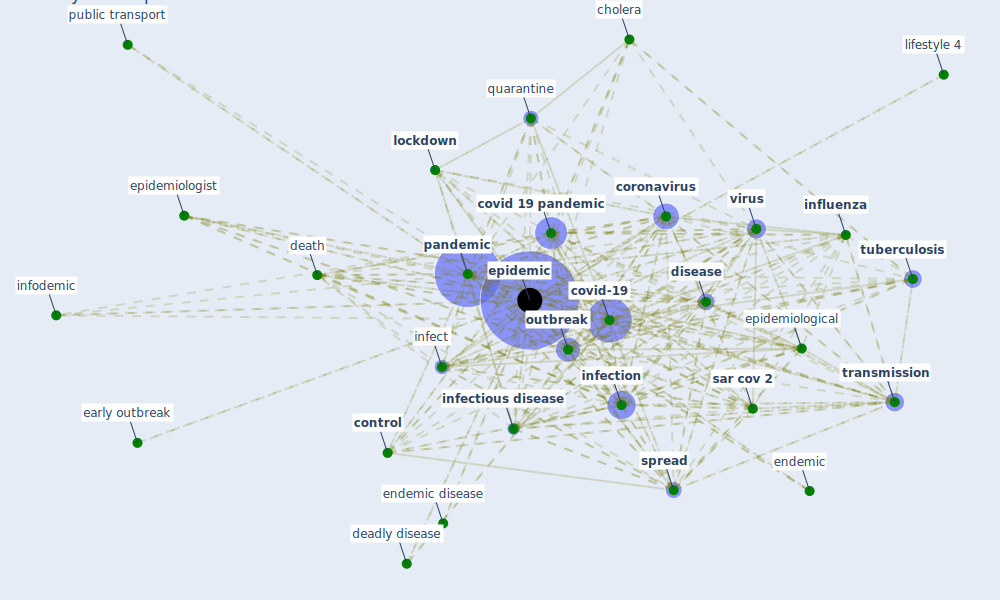

# Keyword: epidemic

## Keywords

 * 1918 influenza pandemic, bentley stringency index, bioterrorism, black death, bubonic plague, [cholera](keyword_cholera), communicable, community hospital, [control](keyword_control), [coronavirus](keyword_coronavirus), coronavirus disease covid 19 severe acute respiratory syndrome coronavirus 2, [coronavirus outbreak](keyword_coronavirus_outbreak), [covid 19 crisis](keyword_covid_19_crisis), covid 19 epidemic, covid 19 in china, covid 19 like, covid 19 outbreak, [covid 19 pandemic](keyword_covid_19_pandemic), [covid-19](keyword_covid-19), deadly disease, death, diagnostic testing, [disease](keyword_disease), disease fatality, disease spread, domino effect, early outbreak, early warning, economic risk, emergency, endemic, endemic disease, [epidemic](keyword_epidemic), epidemic cycle, epidemic potential, [epidemiological](keyword_epidemiological), epidemiologist, [epidemiology](keyword_epidemiology), event kg, feature, [fever](keyword_fever), flu, gdan sk, gdansk, gender equality, global, globalize world, [health](keyword_health), [health care](keyword_health_care), household spending, human cases, [infect](keyword_infect), [infection](keyword_infection), [infectious disease](keyword_infectious_disease), [influenza](keyword_influenza), [influenza virus](keyword_influenza_virus), infodemic, leishmaniasis, [lic](keyword_lic), lifestyle 4, [lockdown](keyword_lockdown), [malaria](keyword_malaria), material and method, misleading medium coverage, mobility hotspot, non contact services, [outbreak](keyword_outbreak), [pandemic](keyword_pandemic), pandemic control and prevention, [pathogen](keyword_pathogen), peak, place of residence, [population](keyword_population), post epidemic, primary defense, [public health](keyword_public_health), public spending, [public transport](keyword_public_transport), [quarantine](keyword_quarantine), r0, restriction of movement, resurgence, [risk](keyword_risk), rvf, [sar cov 2](keyword_sar_cov_2), [spain](keyword_spain), [spread](keyword_spread), spread infection, spread of the infection, stage 3, tehran, [transmission](keyword_transmission), transmission control, transmission dynamic, true epidemic, [tuberculosis](keyword_tuberculosis), [virus](keyword_virus), [vulnerability](keyword_vulnerability), world community, yellow fever

## Mapping

## Neighbours

### Closest articles

* Prophylactic Architecture: Formulating the Concept of Pandemic-Resilient Homes - [LINK](article_elrayies_prophylactic_2022)
* Understanding the role of urban design in disease spreading - [LINK](article_brizuela_understanding_2019)
* A critical review of heating, ventilation, and air conditioning (HVAC) systems within the context of a global SARS-CoV-2 epidemic - [LINK](article_elsaid_critical_2021)
* The impact of climate change on the epidemiology and control of Rift Valley fever - PubMed - [LINK](article_martin_impact_2008)
* The impact of COVID-19 and strategies for mitigation and suppression in low- and middle-income countries - [LINK](article_walker_impact_2020)
* A Review on Building Design as a Biomedical System for Preventing COVID-19 Pandemic - [LINK](article_amran_review_2022)
* COVID-19 Pandemic: Rethinking Strategies for Resilient Urban Design, Perceptions, and Planning - [LINK](article_afrin_covid-19_2021)
* Addressing vulnerability, building resilience: community-based adaptation to vector-borne diseases in the context of global change - [LINK](article_bardosh_addressing_2017)
* Questioning the use of the balcony in apartments during the COVID-19 pandemic process - [LINK](article_aydin_questioning_2020)
* Mitigation strategies and compliance in the COVID-19 fight; how much compliance is enough? - [LINK](article_mukerjee_mitigation_2021)

### Closest BPs

