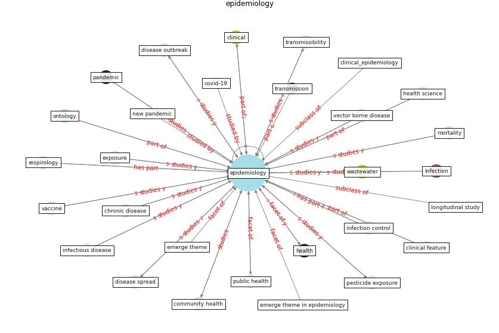

# Keyword: __epidemiology__
## Clusters

* Cluster 15: [ontology-datum](cluster_15)

## Concepts

 

## Articles
* Computational analysis of SARS-CoV-2/COVID-19
surveillance by wastewater-based epidemiology locally and
globally: Feasibility, economy, opportunities and
challenges ([hart_computational_2020](article_hart_computational_2020))
* An Overview of Biomedical Ontologies for Pandemics
and Infectious Diseases Representation ([bayoudhi_overview_2021](article_bayoudhi_overview_2021))
* Respiratory pandemics, urban planning and design: A
multidisciplinary rapid review of the literature ([harris_respiratory_2022](article_harris_respiratory_2022))
* Construction of a Linked Data Set of COVID-19
Knowledge Graphs: Development and Applications ([wang_construction_2022](article_wang_construction_2022))
* The COVID-19 epidemiology and monitoring ontology ([queralt-rosinach_covid-19_2021](article_queralt-rosinach_covid-19_2021))
* The socio-economic determinants of COVID-19: A spatial
analysis of German county level data ([ehlert_socio-economic_2021](article_ehlert_socio-economic_2021))
* Mental health economics: A prospective study on
psychological flourishing and associations with healthcare
costs and sickness benefit transfers in Denmark ([santini_mental_2021](article_santini_mental_2021))
* Treating two pandemics for the price of one: Chronic and
infectious disease impacts of the built and natural
environment ([frank_treating_2021](article_frank_treating_2021))
* Understanding the role of urban design in disease
spreading ([brizuela_understanding_2019](article_brizuela_understanding_2019))
* RUDDS_bioRxiv_update ([RUDDS_bioRxiv_update](article_RUDDS_bioRxiv_update))
