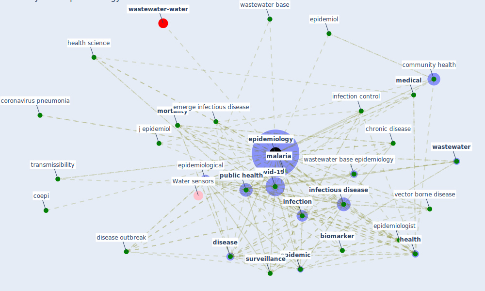

# Keyword: epidemiology

* [wastewater-water](cluster_0)

## Keywords

 * Cluster_0, abu raddad lj, academic domain, antiepidemic good, basic reproduction number, biological, biology, [biomarker](keyword_biomarker), case detection, chemaitelly h, [chronic disease](keyword_chronic_disease), [clinical](keyword_clinical), clinical_epidemiology, coepi, community health, consensus document, coronavirus disease, coronavirus disease covid 19 outbreak, coronavirus pandemic epidemiology consortium, coronavirus pneumonia, covid 19 outbreak, covid pandemic, [covid-19](keyword_covid-19), [disease](keyword_disease), disease interactions, disease outbreak, disease risk, disease spread, drug abuse, early detection system, ecology, emerge infectious disease, emerge theme, emerge theme in epidemiology, [epidemic](keyword_epidemic), epidemic behavior, epidemiol, epidemiol int j, [epidemiological](keyword_epidemiological), epidemiologist, [epidemiology](keyword_epidemiology), epidemiology disease control, epidemiology of first 90 day into covid 19 pandemic, epidemiology of sar cov 2, european environment and epidemiology e3 network, [exposure](keyword_exposure), exposure science, geographic information system, [health](keyword_health), health science, [infection](keyword_infection), [infection control](keyword_infection_control), [infectious disease](keyword_infectious_disease), infectious disease surveillance, j epidemiol, [malaria](keyword_malaria), [medical](keyword_medical), medicine, mobile technology, [mortality](keyword_mortality), multilevelanalysis, [ontology](keyword_ontology), [pandemic](keyword_pandemic), pathogenesis, pesticide exposure, pitzer, population movement, prevalence of obesity, primary concentration, psychiatric science, [public health](keyword_public_health), public health emergency management, respirology, risk factor, [sar cov 2](keyword_sar_cov_2), sewage wastewater surveillance, [social](keyword_social), source of infection, spatial, spatio temporal, [spread](keyword_spread), [surveillance](keyword_surveillance), [symptom](keyword_symptom), taxonomy, tracking system, transdisciplinary approach, transmissibility, [transmission](keyword_transmission), transmission rate, urbanization, [vaccine](keyword_vaccine), [vector borne disease](keyword_vector_borne_disease), [viral](keyword_viral), virology, [wastewater](keyword_wastewater), wastewater base, wastewater base epidemiology, wastewater based epidemiology biomarkers, wastewater surveillance of covid 19, wbe concept

## Mapping

## Neighbours

### Closest articles

* Future perspectives of wastewater-based epidemiology: Monitoring infectious disease spread and resistance to the community level - [LINK](article_sims_future_2020)
* Computational analysis of SARS-CoV-2/COVID-19 surveillance by wastewater-based epidemiology locally and globally: Feasibility, economy, opportunities and challenges - [LINK](article_hart_computational_2020)
* Respiratory pandemics, urban planning and design: A multidisciplinary rapid review of the literature - [LINK](article_harris_respiratory_2022)
* Construction of a Linked Data Set of COVID-19 Knowledge Graphs: Development and Applications - [LINK](article_wang_construction_2022)
* An Overview of Biomedical Ontologies for Pandemics and Infectious Diseases Representation - [LINK](article_bayoudhi_overview_2021)
* Decision Making within the Built Environment as a Strategy for Mitigating the Risk of Malaria and Other Vector-Borne Diseases - [LINK](article_obonyo_decision_2018)
* The COVID-19 epidemiology and monitoring ontology - [LINK](article_queralt-rosinach_covid-19_2021)
* The socio-economic determinants of COVID-19: A spatial analysis of German county level data - [LINK](article_ehlert_socio-economic_2021)
* Mental health economics: A prospective study on psychological flourishing and associations with healthcare costs and sickness benefit transfers in Denmark - [LINK](article_santini_mental_2021)
* Detection of SARS-CoV-2 in raw and treated wastewater in Germany – Suitability for COVID-19 surveillance and potential transmission risks - [LINK](article_westhaus_detection_2021)

### Closest BPs

