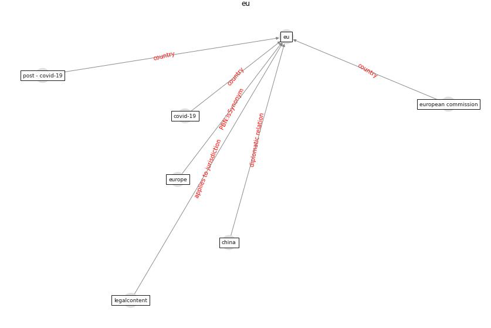

# Keyword: __eu__
## Clusters

* Cluster 1: [om-ai](cluster_1)

## Concepts

 

## Articles
* Borders and Catastrophe: lessons from COVID-19 for the
European Green Deal ([klein_borders_2021](article_klein_borders_2021))
* council_of_europe_2020_2020-250 ([council_of_europe_2020_2020-250](article_council_of_europe_2020_2020-250))
* eurofund_sustainable_2016-950 ([eurofund_sustainable_2016-950](article_eurofund_sustainable_2016-950))
* eurofund_sustainable_2016-200 ([eurofund_sustainable_2016-200](article_eurofund_sustainable_2016-200))
* eurofund_sustainable_2016-1400 ([eurofund_sustainable_2016-1400](article_eurofund_sustainable_2016-1400))
* eurofund_sustainable_2016-150 ([eurofund_sustainable_2016-150](article_eurofund_sustainable_2016-150))
* eurofund_sustainable_2016-1650 ([eurofund_sustainable_2016-1650](article_eurofund_sustainable_2016-1650))
* What has been the impact of the COVID-19 pandemic on
immigrants? An update on recent evidence ([oecd_what_2022](article_oecd_what_2022))
* eurofund_sustainable_2016-350 ([eurofund_sustainable_2016-350](article_eurofund_sustainable_2016-350))
* Challenges of data sharing in European Covid-19
projects: A learning opportunity for advancing pandemic
preparedness and response ([tacconelli_challenges_2022](article_tacconelli_challenges_2022))
