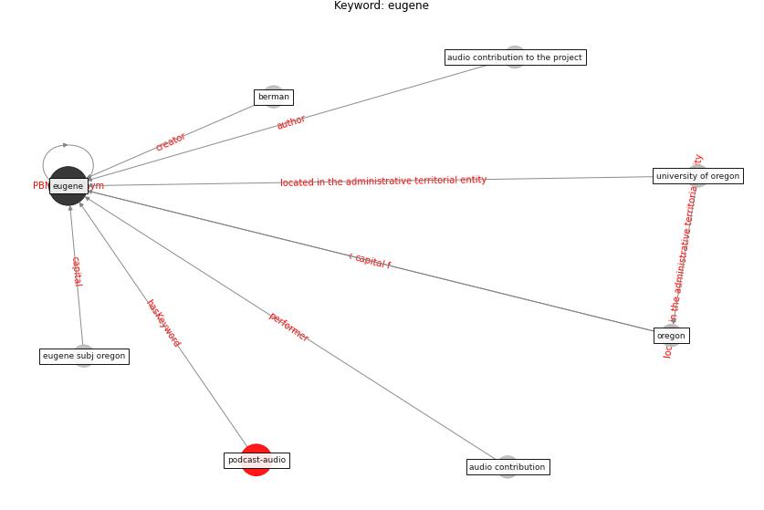

# Keyword: eugene

* [podcast-audio](cluster_Cluster_7)

## Keywords

 * Cluster_7, audio contribution, audio contribution to the project, berman, [eugene](keyword_eugene), eugene subj oregon, oregon, university of oregon

## Concepts

 

## Neighbours

### Closest articles

* Ten questions concerning occupant health in buildings during normal operations and extreme events including the COVID-19 pandemic - [LINK](article_awada_ten_2021)
* The City Under COVID‐19: Podcasting As Digital Methodology - [LINK](article_rogers_city_2020)
* 2019 Novel Coronavirus (COVID-19) Pandemic: Built Environment Considerations To Reduce Transmission - [LINK](article_dietz_2019_2020)

### Closest BPs

