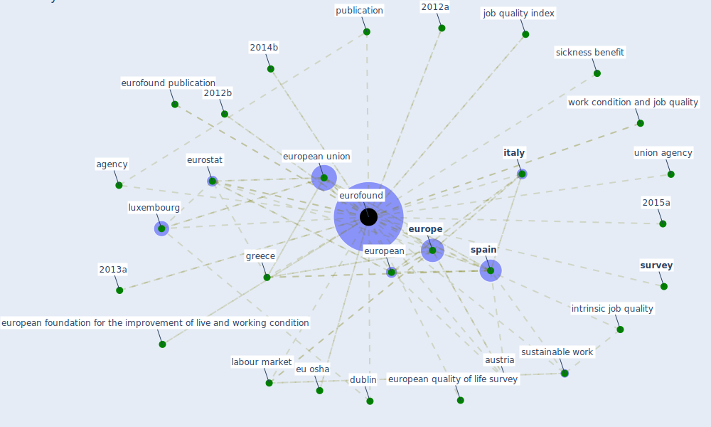

# Keyword: eurofound

## Keywords

 * 2012a, 2012b, 2013a, 2013b, 2014b, 2015a, agency, [austria](keyword_austria), [bulgaria](keyword_bulgaria), dublin, eu agency, eu osha, [eurofound](keyword_eurofound), eurofound publication, [europe](keyword_europe), european, european context, european foundation for the improvement of live and working condition, european quality of life survey, [european union](keyword_european_union), eurostat, fifth ewcs, greece, intrinsic job quality, [italy](keyword_italy), job quality index, [labour market](keyword_labour_market), luxembourg, publication, sickness benefit, [spain](keyword_spain), [survey](keyword_survey), [sustainable work](keyword_sustainable_work), union agency, work condition and job quality, work life balance

## Mapping

## Neighbours

### Closest articles

* Sustainable work throughout the life course: National policies and strategies, Publications Office of the European Union - [LINK](article_eurofund_sustainable_2016)

### Closest BPs

