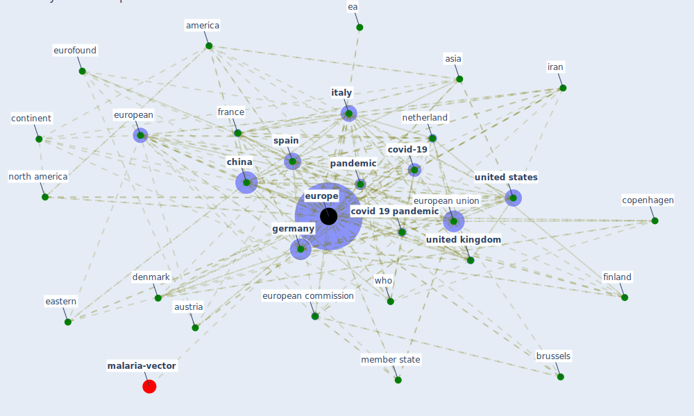

# Keyword: europe

* [malaria-vector](cluster_13)

## Keywords

 * ae, [africa](keyword_africa), america, asia, asian country, [austria](keyword_austria), belgium, brit, britain, brussels, central, centre for disease prevention and control, [china](keyword_china), continent, copenhagen, [country](keyword_country), [covid 19 crisis](keyword_covid_19_crisis), [covid 19 pandemic](keyword_covid_19_pandemic), [covid-19](keyword_covid-19), czech republic, [denmark](keyword_denmark), dutch, ea, eastern, ec, ecdc, eea, energy use, english language, eu level institution, eu member state, eu s fight against covid 19, eurata consortium, euro, [eurofound](keyword_eurofound), [europe](keyword_europe), european, european commission, european council, european environment agency, european investment bank, [european union](keyword_european_union), eurostat, [finland](keyword_finland), [france](keyword_france), [germany](keyword_germany), [greece](keyword_greece), green deal, [health](keyword_health), hungary, in work poverty, iran, [italy](keyword_italy), [labour market](keyword_labour_market), large economy, latin america, lithuania, [lockdown](keyword_lockdown), [london](keyword_london), medieval, [member state](keyword_member_state), mexico, middle east, monaco, neighboring country, [netherland](keyword_netherland), [north america](keyword_north_america), northern hemisphere, [pandemic](keyword_pandemic), [poland](keyword_poland), politico eu, [portugal](keyword_portugal), president of the eu commission, problem loan, public policy, ranson, recession, recovery plan for europe, region, romania, sanatorium, [social](keyword_social), south, south america, southeastern, [spain](keyword_spain), state aid, [sweden](keyword_sweden), [switzerland](keyword_switzerland), teleworke, th ti h th t h l g, the uk, tunisia, u s, [united kingdom](keyword_united_kingdom), [united states](keyword_united_states), western, who, [world health organization](keyword_world_health_organization), zikalliance

## Mapping

## Neighbours

### Closest articles

* Borders and Catastrophe: lessons from COVID-19 for the European Green Deal - [LINK](article_klein_borders_2021)
* Sustainable work throughout the life course: National policies and strategies, Publications Office of the European Union - [LINK](article_eurofund_sustainable_2016)
* World Bank Development Report - [LINK](article_world_bank_world_2022)
* Prototype Early Warning Systems for Vector-Borne Diseases in Europe - [LINK](article_semenza_prototype_2015)
* 2020 Data Protection Report - [LINK](article_council_of_europe_2020_2020)
* Strengthening resilience: a priority shared by Health 2020 and - [LINK](article_who_strengthening_2017)
* Covid-19 and asset management in EU: a preliminary assessment of performance and investment styles - [LINK](article_rizvi_covid-19_2020)
* What has been the impact of the COVID-19 pandemic on immigrants? An update on recent evidence - [LINK](article_oecd_what_2022)
* A critical analysis of the impacts of COVID-19 on the global economy and ecosystems and opportunities for circular economy strategies - [LINK](article_ibn-mohammed_critical_2021)
* The impact of climate change on the epidemiology and control of Rift Valley fever - PubMed - [LINK](article_martin_impact_2008)

### Closest BPs

