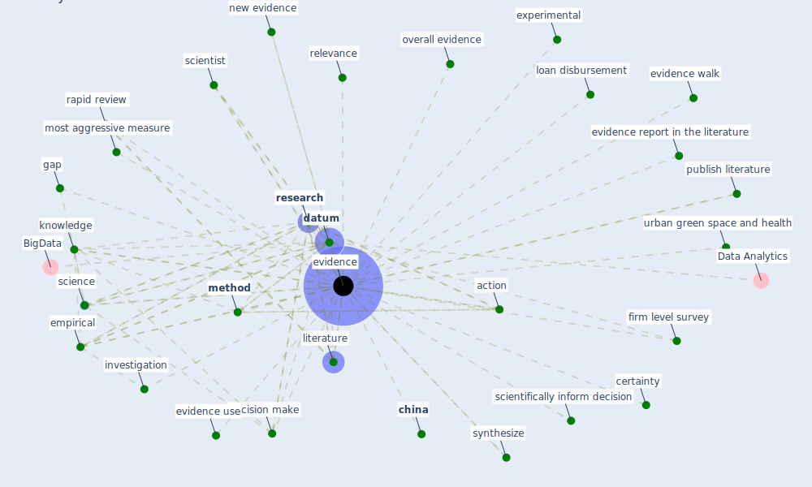

# Keyword: evidence

## Keywords

 * 438 u s city, absence of evidence, accessible, action, actionable evidence, bias, case study, certainty, [china](keyword_china), chinese experience, chinese experiment, concept, credible, credible hub, [crisis](keyword_crisis), crisis situation, critical, [datum](keyword_datum), de jure, decision make, decision make process, decision make tool, demand for evidence, ecuador, empirical, [evidence](keyword_evidence), evidence base, evidence base information, evidence base medicine, evidence brief, evidence report in the literature, evidence use, evidence walk, experimental, firm level survey, gap, [globalisation](keyword_globalisation), health care and wellbeing, health datum, high evidence standard, indoor green activity, investigation, [knowledge](keyword_knowledge), knowledge gap, literature, loan disbursement, [method](keyword_method), most aggressive measure, myth, new evidence, no strong evidence for a disproportionate impact on specific group, observational, [opinion](keyword_opinion), overall evidence, [policy](keyword_policy), [practice](keyword_practice), private sme, process, publish literature, rapid review, relevance, relevant evidence, [research](keyword_research), research finding, rigor, risk of bias, school effect on pupil health behaviour, science, scientifically inform decision, scientist, [sme](keyword_sme), statistical, [sustainability](keyword_sustainability), synthesis, synthesize, systematic review, the health benefits of urban greenspaces, the most aggressive measure, the psychologicalimpact of quarantine and how to reduce it, there, urban green space and health, valid, validate, validity, well available evidence

## Mapping

## Neighbours

### Closest articles

* Amplifying the role of knowledge translation platforms in the COVID-19 pandemic response - [LINK](article_el-jardali_amplifying_2020)
* Contributions of Smart City Solutions and Technologies to Resilience against the COVID-19 Pandemic: A Literature Review - [LINK](article_sharifi_contributions_2021)
* Coronavirus questions that will not go away: interrogating urban and socio-spatial implications of COVID-19 measures - [LINK](article_salama_coronavirus_2020)
* Challenges of data sharing in European Covid-19 projects: A learning opportunity for advancing pandemic preparedness and response - [LINK](article_tacconelli_challenges_2022)
* World Bank Development Report - [LINK](article_world_bank_world_2022)
* Strengthening resilience: a priority shared by Health 2020 and - [LINK](article_who_strengthening_2017)
* Health, Wellbeing \& Productivity in Offices - [LINK](article_world_green_building_council_health_2014)
* Coronavirus disease 2019: The harms of exaggerated information and non‐evidence‐based measures - [LINK](article_ioannidis_coronavirus_2020)
* Urban planning after COVID-19 - [LINK](article_rtpi_urban_2021)
* The COVID-19 pandemic: Impacts on cities and major lessons for urban planning, design, and management - [LINK](article_sharifi_covid-19_2020)

### Closest BPs

