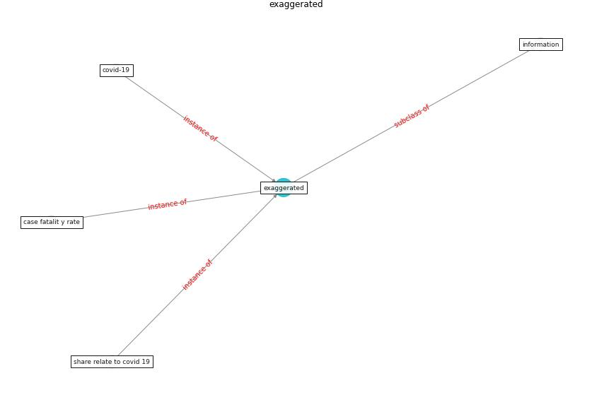

# Keyword: __exaggerated__
## Clusters

* Cluster 14: [onlinelibrary-wiley](cluster_14)

## Concepts

 

## Articles
* The changes in the effects of social media use of
Cypriots due to COVID-19 pandemic ([kaya_changes_2020](article_kaya_changes_2020))
* Coronavirus disease 2019: The harms of exaggerated
information and non‐evidence‐based measures ([ioannidis_coronavirus_2020](article_ioannidis_coronavirus_2020))
* RUDDS_bioRxiv_update ([RUDDS_bioRxiv_update](article_RUDDS_bioRxiv_update))
* p15-lee-vor ([p15-lee-vor](article_p15-lee-vor))
* Effects to Construction Project Management
Impacted Circular Economic of Covid-19 Pandemic ([paikan_effects_2021](article_paikan_effects_2021))
* Impacts of COVID-19 on Health and Safety of
Workforce in Construction Industry ([pamidimukkala_impacts_2021](article_pamidimukkala_impacts_2021))
* Health, Economic and Social Development Challenges
of the COVID-19 Pandemic: Strategies for Multiple
and Interconnected Issues ([panneer_health_2022](article_panneer_health_2022))
* COVID-19 Higher Mortality in Chinese Regions
With Chronic Exposure to Lower Air Quality ([pansini_covid-19_2021](article_pansini_covid-19_2021))
* Continuous IEQ monitoring system: Context and
development ([parkinson_continuous_2019](article_parkinson_continuous_2019))
* Assessment of Building Automation and Control
Systems in Danish Healthcare Facilities in the
COVID-19 Era ([pedersen_assessment_2022](article_pedersen_assessment_2022))
