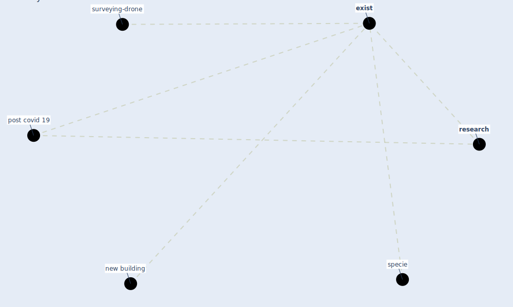

# Keyword: exist

* [surveying-drone](cluster_13)

## Keywords

 * Cluster_13, [exist](keyword_exist), existing, new building, post covid 19, [research](keyword_research), specie

## Mapping

## Neighbours

### Closest articles

* Learning from pandemics: Applying resilience thinking to identify priorities for planning urban settlements - [LINK](article_syal_learning_2021)
* An Overview of Ontologies and Tool Support for COVID-19 Analytics - [LINK](article_ahmad_overview_2021)
*  - [LINK](article_dalessandro_covid-19_2020)
* Designing Post COVID-19 Buildings: Approaches for Achieving Healthy Buildings - [LINK](article_navaratnam_designing_2022)

### Closest BPs

