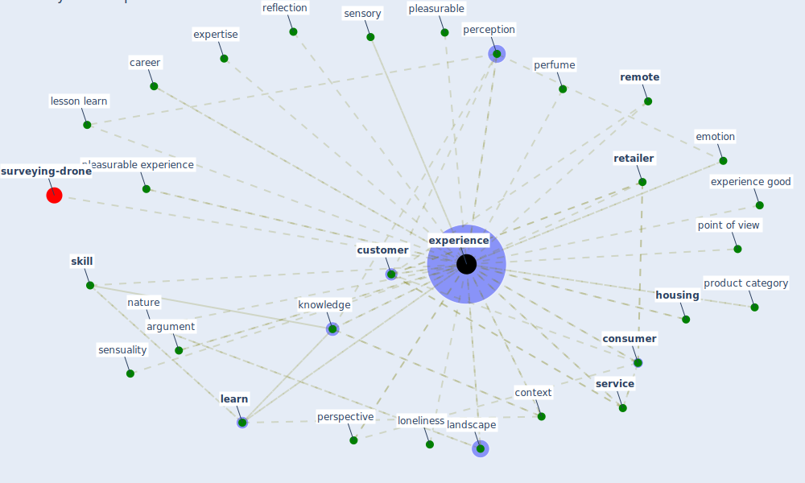

# Keyword: experience

* [surveying-drone](cluster_13)

## Keywords

 * Cluster_13, argument, [brand](keyword_brand), career, [chinese](keyword_chinese), conscious, [consumer](keyword_consumer), context, credence, [customer](keyword_customer), direct sensory, direct sensory experience, emotion, [experience](keyword_experience), experience arcgis com, experience good, experienced, experiences, expertise, food truck, hotelier, [housing](keyword_housing), [knowledge](keyword_knowledge), landscape, [learn](keyword_learn), lesson learn, [loneliness](keyword_loneliness), mean, motivation, multi sensory, [nature](keyword_nature), perception, perfume, [perspective](keyword_perspective), pleasurable, pleasurable experience, point of view, product category, reflection, [remote](keyword_remote), retail, [retailer](keyword_retailer), sensory, sensuality, [service](keyword_service), [skill](keyword_skill), [sound](keyword_sound), [tourism](keyword_tourism), work experience

## Mapping

## Neighbours

### Closest articles

* How COVID-19 Could Accelerate the Adoption of New Retail Technologies and Enhance the (E-)Servicescape - [LINK](article_willems_how_2021)
* Biophilic design in architecture and its contributions to health, well-being, and sustainability: A critical review - [LINK](article_zhong_biophilic_2022)
* The City Under COVID‐19: Podcasting As Digital Methodology - [LINK](article_rogers_city_2020)
* Sustainable work throughout the life course: National policies and strategies, Publications Office of the European Union - [LINK](article_eurofund_sustainable_2016)
* Green infrastructure through the lens of “One Health”: A systematic review and integrative framework uncovering synergies and trade-offs between mental health and wildlife support in cities - [LINK](article_felappi_green_2020)
* Mechanisms for addressing the impact of COVID-19 on infrastructure projects - [LINK](article_king_mechanisms_2021)
* Green in times of COVID-19: urban green space relevance during the COVID-19 pandemic in Buenos Aires City - [LINK](article_marconi_green_2022)
* Health, Wellbeing \& Productivity in Offices - [LINK](article_world_green_building_council_health_2014)
* Contributions of Smart City Solutions and Technologies to Resilience against the COVID-19 Pandemic: A Literature Review - [LINK](article_sharifi_contributions_2021)
* Future perspectives of wastewater-based epidemiology: Monitoring infectious disease spread and resistance to the community level - [LINK](article_sims_future_2020)

### Closest BPs

