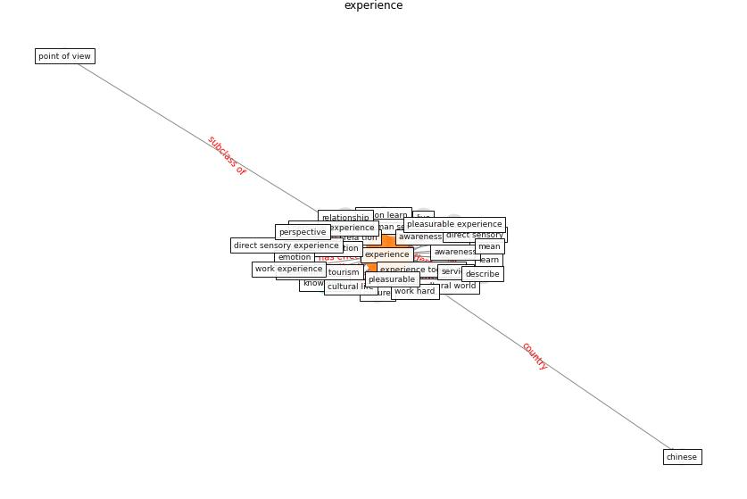

# Keyword: __experience__
## Clusters

* Cluster 2: [construction-resilience](cluster_2)

## Concepts

 

## Articles
* realdania_refleksioner_2022_EN-1950 ([realdania_refleksioner_2022_EN-1950](article_realdania_refleksioner_2022_EN-1950))
* realdania_refleksioner_2022_EN-2200 ([realdania_refleksioner_2022_EN-2200](article_realdania_refleksioner_2022_EN-2200))
* realdania_refleksioner_2022_EN-150 ([realdania_refleksioner_2022_EN-150](article_realdania_refleksioner_2022_EN-150))
* Mechanisms for addressing the impact of COVID-19 on
infrastructure projects ([king_mechanisms_2021](article_king_mechanisms_2021))
* Biophilic design in architecture and its contributions to
health, well-being, and sustainability: A critical
review ([zhong_biophilic_2022](article_zhong_biophilic_2022))
* realdania_refleksioner_2022_EN-1850 ([realdania_refleksioner_2022_EN-1850](article_realdania_refleksioner_2022_EN-1850))
* realdania_refleksioner_2022_EN-2250 ([realdania_refleksioner_2022_EN-2250](article_realdania_refleksioner_2022_EN-2250))
* Contributions of Smart City Solutions and
Technologies to Resilience against the COVID-19
Pandemic: A Literature Review ([sharifi_contributions_2021](article_sharifi_contributions_2021))
* realdania_refleksioner_2022_EN-2050 ([realdania_refleksioner_2022_EN-2050](article_realdania_refleksioner_2022_EN-2050))
* ogunnusi_covid-19_2020-100 ([ogunnusi_covid-19_2020-100](article_ogunnusi_covid-19_2020-100))
