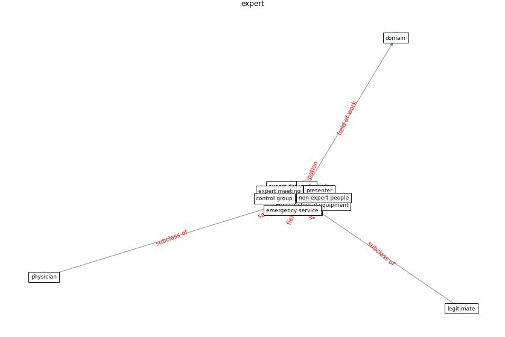

# Keyword: __expert__
## Clusters

* Cluster 2: [construction-resilience](cluster_2)

## Concepts

 

## Articles
* The Impact of Pandemic Crisis on the Survival of
Construction Industry: A Case of COVID-19 ([gamil_impact_2020](article_gamil_impact_2020))
* Graphene-based nanomaterials as antimicrobial surface
coatings: A parallel approach to restrain the expansion
of COVID-19 ([ayub_graphene-based_2021](article_ayub_graphene-based_2021))
* Infodemic and the spread of fake news in the
COVID-19-era ([orso_infodemic_2020](article_orso_infodemic_2020))
* realdania_refleksioner_2022_EN-2600 ([realdania_refleksioner_2022_EN-2600](article_realdania_refleksioner_2022_EN-2600))
* Prophylactic Architecture: Formulating the Concept
of Pandemic-Resilient Homes ([elrayies_prophylactic_2022](article_elrayies_prophylactic_2022))
* The COVID-19 epidemiology and monitoring ontology ([queralt-rosinach_covid-19_2021](article_queralt-rosinach_covid-19_2021))
* tong_coronavirus_2020-0 ([tong_coronavirus_2020-0](article_tong_coronavirus_2020-0))
* The Smart City and Covid‐19 ([webb_smart_2020](article_webb_smart_2020))
* who_strengthening_2017-350 ([who_strengthening_2017-350](article_who_strengthening_2017-350))
* realdania_refleksioner_2022_EN-150 ([realdania_refleksioner_2022_EN-150](article_realdania_refleksioner_2022_EN-150))
