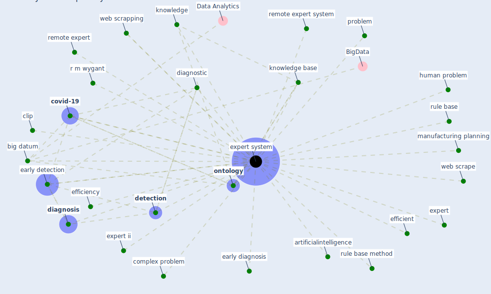

# Keyword: expert system

## Keywords

 * artificialintelligence, [big datum](keyword_big_datum), clip, complex problem, [covid-19](keyword_covid-19), [detection](keyword_detection), [diagnosis](keyword_diagnosis), diagnostic, early detection, early diagnosis, [efficiency](keyword_efficiency), efficient, expert, expert ii, [expert system](keyword_expert_system), expert systems, human problem, [knowledge](keyword_knowledge), knowledge base, manufacturing planning, [ontology](keyword_ontology), problem, r m wygant, remote expert, remote expert system, rule base, rule base method, [web scrape](keyword_web_scrape), web scrapping

## Mapping

## Neighbours

### Closest articles

* Risk Diagnosis and Mitigation System of COVID-19 Using Expert System and Web Scraping - [LINK](article_mufid_risk_2020)
* COVID19-Routes: A Safe Pedestrian Navigation Service - [LINK](article_cantarero_covid19-routes_2021)
* Propositions for a Resilient, Post-COVID-19 Future for the AEC Industry - [LINK](article_nassereddine_propositions_2021)
* An Overview of Biomedical Ontologies for Pandemics and Infectious Diseases Representation - [LINK](article_bayoudhi_overview_2021)
* Pandemic Analytics: How Countries are Leveraging Big Data Analytics and Artificial Intelligence to Fight COVID-19? - [LINK](article_mehta_pandemic_2021)
* Social distancing enhanced automated optimal design of physical spaces in the wake of the COVID-19 pandemic - [LINK](article_ugail_social_2021)

### Closest BPs

