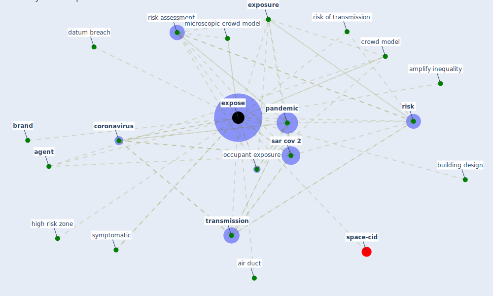

# Keyword: expose

* [space-cid](cluster_2)

## Keywords

 * Cluster_2, [agent](keyword_agent), air duct, amplify inequality, [brand](keyword_brand), building design, [coronavirus](keyword_coronavirus), [crowd model](keyword_crowd_model), datum breach, [expose](keyword_expose), exposed, exposing, [exposure](keyword_exposure), high risk zone, microscopic crowd model, [occupant exposure](keyword_occupant_exposure), [pandemic](keyword_pandemic), [risk](keyword_risk), risk assessment, risk of transmission, [sar cov 2](keyword_sar_cov_2), symptomatic, [transmission](keyword_transmission)

## Mapping

## Neighbours

### Closest articles

* EXPOSED: An occupant exposure model for confined spaces to retrofit crowd models during a pandemic - [LINK](article_ronchi_exposed_2020)
* Analysis of COVID-19 Concerns Raised by the Construction Workforce and Development of Mitigation Practices - [LINK](article_bou_hatoum_analysis_2021)
* COVID-19 Pandemic: Prevention and Protection Measures to Be Adopted at the Workplace - [LINK](article_cirrincione_covid-19_2020)
* Respiratory pandemics, urban planning and design: A multidisciplinary rapid review of the literature - [LINK](article_harris_respiratory_2022)
* COVID-19 and its Modes of Transmission - [LINK](article_karia_covid-19_2020)
* The effect of occupant distribution on energy consumption and COVID-19 infection in buildings: A case study of university building - [LINK](article_mokhtari_effect_2021)
* Identifying Actions to Control and Mitigate the Effects of the COVID-19 Pandemic on Construction Organizations: Preliminary Findings - [LINK](article_raoufi_identifying_2021)
* Leveraging Digital Transformation Technologies to Tackle COVID-19: Proposing a Privacy-First Holistic Framework - [LINK](article_arpaci_leveraging_2021)
* Assessment of COVID-19 precautionary measures in sports facilities: A case study on a health club in Saudi Arabia - [LINK](article_ibrahim_assessment_2022)

### Closest BPs

