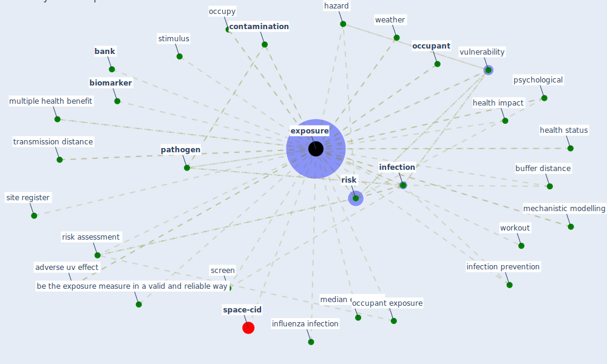

# Keyword: exposure

* [space-cid](cluster_2)

## Keywords

 * Cluster_2, acgih tlv, adverse uv effect, [aerosol](keyword_aerosol), air concentration, airborne pathogen, arrear, [bank](keyword_bank), be the exposure measure in a valid and reliable way, [biomarker](keyword_biomarker), buffer distance, [chronic disease](keyword_chronic_disease), ck, [contamination](keyword_contamination), [covid-19](keyword_covid-19), credit risk, [crowd model](keyword_crowd_model), crowded indoor space, cumulative exposure, danger, direct, direct exposure, [disease](keyword_disease), disease transmission, [disinfection](keyword_disinfection), dose, duration, economic risk, electromagnetic field, endocrine disruptor, [epidemiology](keyword_epidemiology), [expose](keyword_expose), [exposure](keyword_exposure), exposure assumption, exposure assumption in use, exposure by be in the same room, factor k, hazard, health impact, health status, incubation period, indoor space, [infection](keyword_infection), infection prevention, influenza infection, low level exposure risk, map, maximum time of exposure, mechanistic modelling, median exposure, minimum exposure time, minimum possible value, minimum ventilation rate, multiple health benefit, noise level, non perform, nonperforme, [occupant](keyword_occupant), [occupant exposure](keyword_occupant_exposure), occupy, on site, onset of symptom, overflow, [pandemic](keyword_pandemic), [pathogen](keyword_pathogen), [pollutant](keyword_pollutant), [pollution](keyword_pollution), [psychological](keyword_psychological), respiratory infection, [risk](keyword_risk), risk assessment, risk of virus transmission, [sar cov 2](keyword_sar_cov_2), screen, [shock](keyword_shock), silicon photodetector, site register, [sleep](keyword_sleep), solid fuel, spread of disease, stimulus, [stress](keyword_stress), [sunlight](keyword_sunlight), supply shock, t f, the virus, [time](keyword_time), timestep, transmission distance, [uv](keyword_uv), uv exposure region, uv exposure time, valid and reliable, valid and reliable way, [ventilation](keyword_ventilation), ventilationrate, [vulnerability](keyword_vulnerability), water fingerprinting, weather, workout

## Mapping

## Neighbours

### Closest articles

* EXPOSED: An occupant exposure model for confined spaces to retrofit crowd models during a pandemic - [LINK](article_ronchi_exposed_2020)
* World Bank Development Report - [LINK](article_world_bank_world_2022)
* The efficacy of social distance and ventilation effectiveness in preventing COVID-19 transmission - [LINK](article_sun_efficacy_2020)
* Green spaces, especially forest, linked to lower SARS-CoV-2 infection rates: A one-year nationwide study - [LINK](article_jiang_green_2021)
* Future perspectives of wastewater-based epidemiology: Monitoring infectious disease spread and resistance to the community level - [LINK](article_sims_future_2020)
* Upper-Room Ultraviolet Light and Negative Air Ionization to Prevent Tuberculosis Transmission - [LINK](article_escombe_upper-room_2009)
* Addressing vulnerability, building resilience: community-based adaptation to vector-borne diseases in the context of global change - [LINK](article_bardosh_addressing_2017)
* Effects of temperature and humidity on the spread of COVID-19: A systematic review - [LINK](article_mecenas_effects_2020)
* A critical review of heating, ventilation, and air conditioning (HVAC) systems within the context of a global SARS-CoV-2 epidemic - [LINK](article_elsaid_critical_2021)
* Indoor Air Quality: Rethinking rules of building design strategies in post-pandemic architecture - [LINK](article_megahed_indoor_2021)

### Closest BPs

