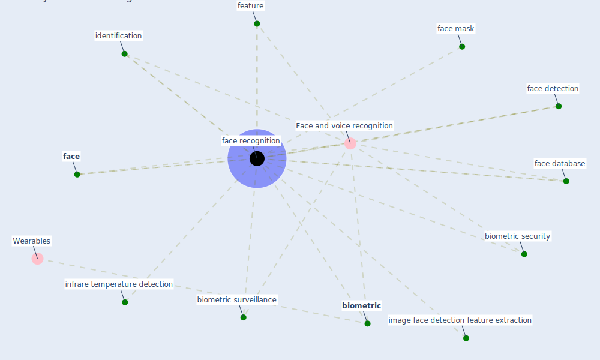

# Keyword: face recognition

## Keywords

 * Face and voice recognition, [biometric](keyword_biometric), biometric security, biometric surveillance, [face](keyword_face), face database, face detection, face mask, [face recognition](keyword_face_recognition), feature, identification, image face detection feature extraction, infrare temperature detection

## Mapping

## Neighbours

### Closest articles

* Recently employed engineering techniques to reduce the spread of COVID-19 (corona virus disease 2019): a review study - [LINK](article_saman_recently_2021)
* How COVID-19 Could Accelerate the Adoption of New Retail Technologies and Enhance the (E-)Servicescape - [LINK](article_willems_how_2021)
*  - [LINK](article_mehtab_alam_role_2021)

### Closest BPs

