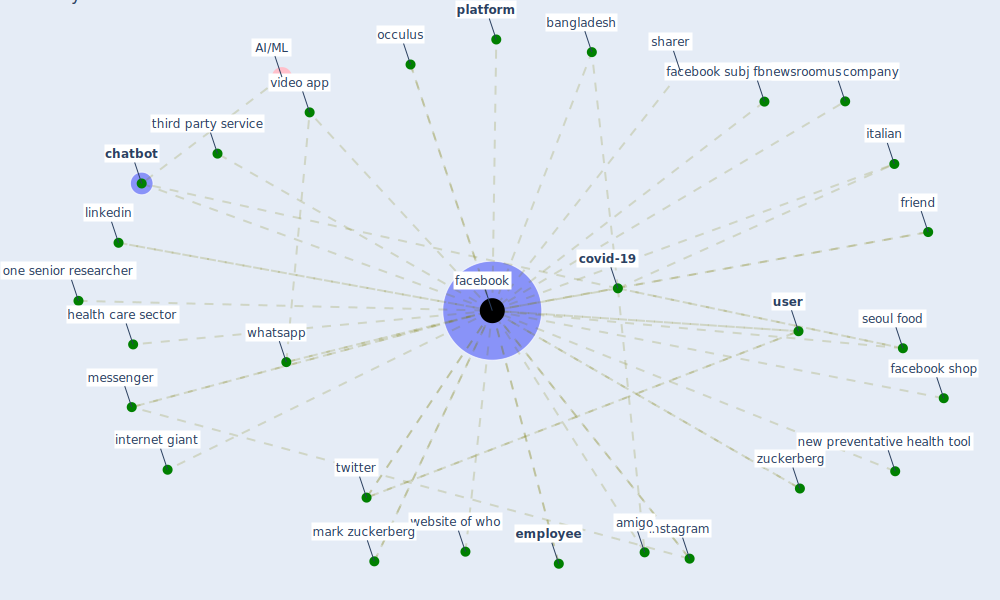

# Keyword: facebook

## Keywords

 * amigo, bangladesh, [chatbot](keyword_chatbot), [covid-19](keyword_covid-19), [employee](keyword_employee), [facebook](keyword_facebook), facebook shop, facebook subj fbnewsroomus, facebook subj fbnewsroomus org, friend, [health care](keyword_health_care), health care sector, health information privacy, instagram, [internet](keyword_internet), internet giant, italian, linkedin, mama s kitchen, mark zuckerberg, marketer, messenger, [misinformation](keyword_misinformation), new preventative health tool, occulus, one senior researcher, patient groups17, pinter, [platform](keyword_platform), [privacy](keyword_privacy), [public space](keyword_public_space), seoul food, sharer, [site](keyword_site), [social](keyword_social), technology company, third party service, [twitter](keyword_twitter), [user](keyword_user), video app, website of who, whatsapp, zuckerberg

## Mapping

## Neighbours

### Closest articles

* How COVID-19 Could Accelerate the Adoption of New Retail Technologies and Enhance the (E-)Servicescape - [LINK](article_willems_how_2021)
* What drives unverified information sharing and cyberchondria during the COVID-19 pandemic? - [LINK](article_laato_what_2020)
* Telehealth overpromises during the Covid-19 pandemic - [LINK](article_ostherr_telehealth_2020)
* A Comprehensive Review of the COVID-19 Pandemic and the Role of IoT, Drones, AI, Blockchain, and 5G in Managing its Impact - [LINK](article_chamola_comprehensive_2020)
* Digital technology and COVID-19 - [LINK](article_ting_digital_2020)
* COVID-19 misinformation: Accuracy of articles about coronavirus prevention mostly shared on social media - [LINK](article_obiala_covid-19_2021)
* Contributions of Smart City Solutions and Technologies to Resilience against the COVID-19 Pandemic: A Literature Review - [LINK](article_sharifi_contributions_2021)
* Infodemic and the spread of fake news in the COVID-19-era - [LINK](article_orso_infodemic_2020)
* A Mixed Approach on Resilience of Spanish Dwellings and Households during COVID-19 Lockdown - [LINK](article_cuerdo-vilches_mixed_2020)
* Amplifying the role of knowledge translation platforms in the COVID-19 pandemic response - [LINK](article_el-jardali_amplifying_2020)

### Closest BPs

