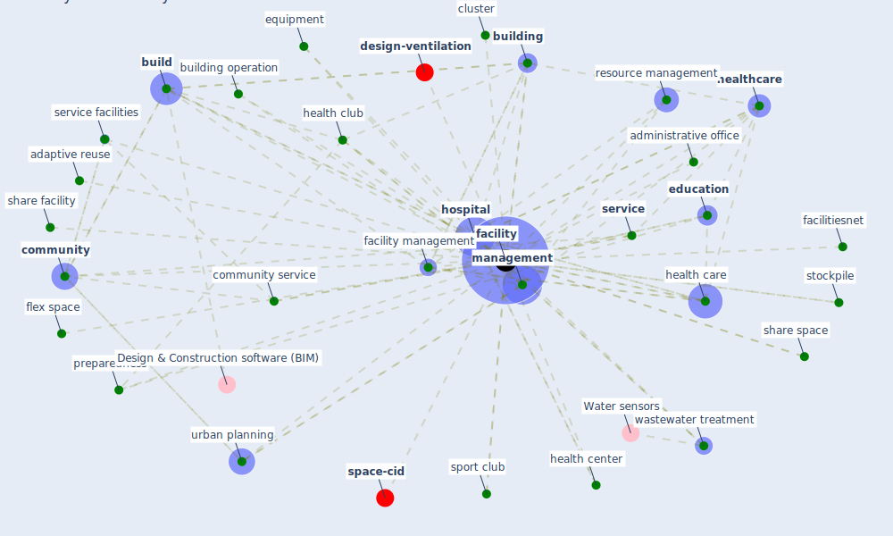

# Keyword: facility

* [design-ventilation](cluster_2)

* [space-cid](cluster_12)

## Keywords

 * Cluster_12, Cluster_2, adaptive reuse, administrative office, [build](keyword_build), [building](keyword_building), building operation, cluster, [community](keyword_community), community administrative office facilities, community service, community service facilities, community welfare, [education](keyword_education), equipment, exercise fa cilitie, facilities, facilitiesnet, [facility](keyword_facility), [facility management](keyword_facility_management), [flex space](keyword_flex_space), [health care](keyword_health_care), health center, [health club](keyword_health_club), [healthcare](keyword_healthcare), healthcare facility today, healthcare setting, [hospital](keyword_hospital), [management](keyword_management), pandemic prevention, pandemic prevention measure, [pathogen](keyword_pathogen), post occupancy evaluation, preparedness, publicface, resource management, safe operation, [service](keyword_service), service facilities, share facility, share space, sport club, stockpile, [urban planning](keyword_urban_planning), wastewater treatment

## Mapping

## Neighbours

### Closest articles

* Assessment of COVID-19 precautionary measures in sports facilities: A case study on a health club in Saudi Arabia - [LINK](article_ibrahim_assessment_2022)
* Urban Community Sustainable Development Patterns under the Influence of COVID-19: A Case Study Based on the Non-Contact Interaction Perspective of Hangzhou City - [LINK](article_wang_urban_2021)
* A Review on Building Design as a Biomedical System for Preventing COVID-19 Pandemic - [LINK](article_amran_review_2022)
* COVID-19 and Green Housing: A Review of Relevant Literature - [LINK](article_kaklauskas_covid-19_2021)
* Towards the sustainable development of smart cities through mass video surveillance: A response to the COVID-19 pandemic - [LINK](article_shorfuzzaman_towards_2021)
* A review of facilities management interventions to mitigate respiratory infections in existing buildings - [LINK](article_zhang_review_2022)
* Antivirus-built environment: Lessons learned from Covid-19 pandemic - [LINK](article_megahed_antivirus-built_2020)
*  - [LINK](article_dalessandro_covid-19_2020)
* Prophylactic Architecture: Formulating the Concept of Pandemic-Resilient Homes - [LINK](article_elrayies_prophylactic_2022)
* Readiness Assessment of Green Building Certification Systems for Residential Buildings during Pandemics - [LINK](article_tleuken_readiness_2021)

### Closest BPs

