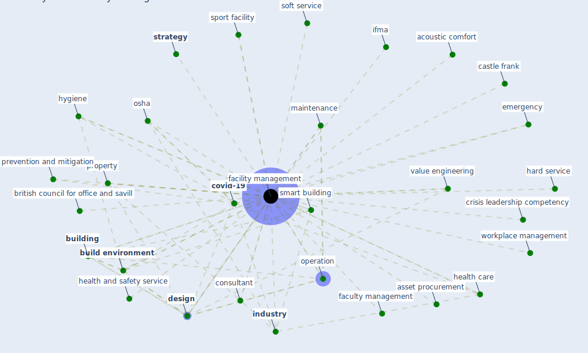

# Keyword: facility management

## Keywords

 * acoustic comfort, asset procurement, british council for office and savill, [build](keyword_build), build asset procurement, [build environment](keyword_build_environment), [building](keyword_building), castle frank, [clean](keyword_clean), commission service, [construction industry](keyword_construction_industry), consultant, [covid-19](keyword_covid-19), crisis leadership competency, current crisis, datum management, [design](keyword_design), emergency, [energy consumption](keyword_energy_consumption), [facility](keyword_facility), [facility management](keyword_facility_management), facility management and clean, facility management sector, faculty management, gwenzi, hard service, health and safety service, [health care](keyword_health_care), [hvac](keyword_hvac), hygiene, ifma, [industry](keyword_industry), maintenance, manage, [management](keyword_management), management strategy, management team, modularly build facility, [office](keyword_office), operation, [osha](keyword_osha), outsource workplace management, prevention and mitigation, profession, property, resource management, [smart building](keyword_smart_building), soft service, sport facility, [strategy](keyword_strategy), technology disruption, user centric, [value engineering](keyword_value_engineering), vbd, vbd control, workforce experience, workplace experience, [workplace management](keyword_workplace_management)

## Mapping

## Neighbours

### Closest articles

* A Global Survey of Infection Control and Mitigation Measures for Combating the Transmission of COVID-19 Pandemic in Buildings Under Facilities Management Services - [LINK](article_sarvari_global_2022)
* Overcoming the Impact of COVID-19 Using Integrated Project Delivery Model - [LINK](article_g_overcoming_2020)
* A review of facilities management interventions to mitigate respiratory infections in existing buildings - [LINK](article_zhang_review_2022)
* A study on office workplace modification during the COVID-19 pandemic in The Netherlands - [LINK](article_hou_study_2021)
* Assessment of COVID-19 precautionary measures in sports facilities: A case study on a health club in Saudi Arabia - [LINK](article_ibrahim_assessment_2022)
* Impact of COVID-19 on IoT Adoption in Healthcare, Smart Homes, Smart Buildings, Smart Cities, Transportation and Industrial IoT - [LINK](article_umair_impact_2021)
* Occupant health in buildings: Impact of the COVID-19 pandemic on the opinions of building professionals and implications on research - [LINK](article_awada_occupant_2022)
* COVID-19 pandemic: the effects and prospects in the construction industry. - [LINK](article_ogunnusi_covid-19_2020)
* Health, Wellbeing \& Productivity in Offices - [LINK](article_world_green_building_council_health_2014)
* Effects to Construction Project Management Impacted Circular Economic of Covid-19 Pandemic - [LINK](article_paikan_effects_2021)

### Closest BPs

