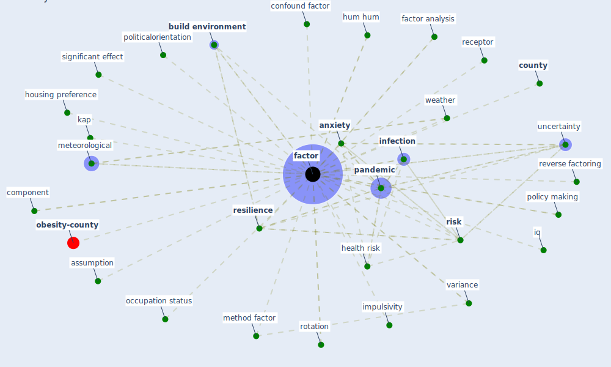

# Keyword: factor

* [obesity-county](cluster_9)

## Keywords

 * Cluster_9, age, alcohol consumption, [anxiety](keyword_anxiety), assumption, borreliacidal, [build environment](keyword_build_environment), build environment change, business environment, characteristic of the household, cluster, cognitive load, [compliance](keyword_compliance), compliance with the measure, component, confound, confound factor, consumer preference, [control](keyword_control), [county](keyword_county), cumulative exposure, default risk ratio, [demographic](keyword_demographic), disruption, dynamic of the pandemic, early warning system, [ecosystem](keyword_ecosystem), [exposure](keyword_exposure), [factor](keyword_factor), factor analysis, factoring, factors, [flourish](keyword_flourish), gender, green route, [health](keyword_health), health risk, housing preference, hum hum, impulsivity, [infection](keyword_infection), intervention strategy, iq, kap, level of danger, meteorological, method factor, occupation status, option, [pandemic](keyword_pandemic), policy making, politicalorientation, primary construction area, productivity productivity, [quantile](keyword_quantile), receptor, reliability, [resilience](keyword_resilience), respiratory droplet, reverse factoring, [risk](keyword_risk), risk of getting infect, rotation, [route](keyword_route), significant, significant effect, smoking, statistic, subjective, subtheme, temperature dependent of rate change, uncertainty, [variable](keyword_variable), variance, vif, [vulnerability](keyword_vulnerability), weather, weight

## Mapping

## Neighbours

### Closest articles

* Should I Stay or Should I Go? Tourists’ COVID-19 Risk Perception and Vacation Behavior Shift - [LINK](article_bratic_should_2021)
* Strengthening resilience: a priority shared by Health 2020 and - [LINK](article_who_strengthening_2017)
* What drives unverified information sharing and cyberchondria during the COVID-19 pandemic? - [LINK](article_laato_what_2020)
* COVID-19 and regional solutions for mitigating the risk of SME finance in selected ASEAN member states - [LINK](article_taghizadeh-hesary_covid-19_2022)
* Effects of temperature and humidity on the spread of COVID-19: A systematic review - [LINK](article_mecenas_effects_2020)
* The Intelligent Lockdown: Compliance with COVID-19 Mitigation Measures in the Netherlands - [LINK](article_kuiper_intelligent_2020)
* Compliance with COVID-19 Mitigation Measures in the United States - [LINK](article_van_rooij_compliance_2020)
* Revisiting the built environment: 10 potential development changes and paradigm shifts due to COVID-19 - [LINK](article_cheshmehzangi_revisiting_2021)
* Treating two pandemics for the price of one: Chronic and infectious disease impacts of the built and natural environment - [LINK](article_frank_treating_2021)
* Review and comparison of HVAC operation guidelines in different countries during the COVID-19 pandemic - [LINK](article_guo_review_2021)

### Closest BPs

