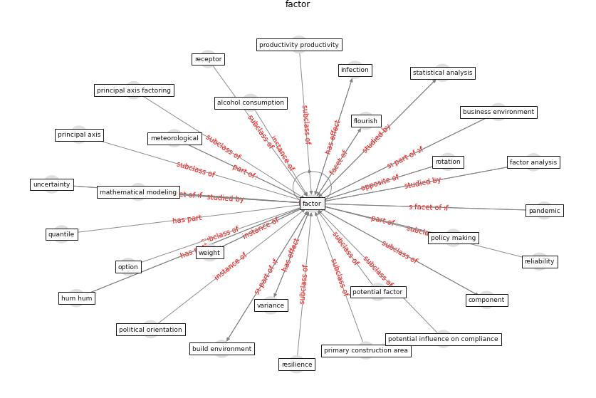

# Keyword: __factor__
## Clusters

* Cluster 7: [tourism-tourist](cluster_7)

## Concepts

 

## Top 10 articles for __factor__
* Should I Stay or Should I Go? Tourists’
COVID-19 Risk Perception and Vacation Behavior
Shift ([bratic_should_2021](article_bratic_should_2021))
* The Intelligent Lockdown: Compliance with COVID-19
Mitigation Measures in the Netherlands ([kuiper_intelligent_2020](article_kuiper_intelligent_2020))
* who_strengthening_2017 ([who_strengthening_2017](article_who_strengthening_2017))
* Compliance with COVID-19 Mitigation Measures in the
United States ([van_rooij_compliance_2020](article_van_rooij_compliance_2020))
* What drives unverified information sharing and
cyberchondria during the COVID-19 pandemic? ([laato_what_2020](article_laato_what_2020))
* COVID-19 and regional solutions for mitigating the risk
of SME finance in selected ASEAN member states ([taghizadeh-hesary_covid-19_2022](article_taghizadeh-hesary_covid-19_2022))
* COVID-19 and Green Housing: A Review of
Relevant Literature ([kaklauskas_covid-19_2021](article_kaklauskas_covid-19_2021))
* The COVID-19 pandemic: Impacts on cities and major
lessons for urban planning, design, and management ([sharifi_covid-19_2020](article_sharifi_covid-19_2020))
* Mapping research in logistics and supply chain management
during COVID-19 pandemic ([montoya-torres_mapping_2021](article_montoya-torres_mapping_2021))
* Effects of temperature and humidity on the spread of
COVID-19: A systematic review ([mecenas_effects_2020](article_mecenas_effects_2020))
