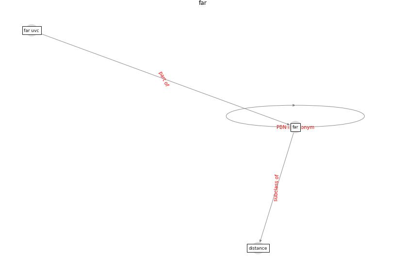

# Keyword: __far__
## Clusters

* Cluster 5: [uvc-hcov](cluster_5)

## Concepts

 

## Top 10 articles for __far__
* Exploring the Non-Medical impacts of Covid-19 using
Natural Language Processing ([agade_exploring_2020](article_agade_exploring_2020))
* Design COVID-19 Ontology: A Healthcare and
Safety Perspective ([aloulou_design_2022](article_aloulou_design_2022))
* Far-UVC light (222 nm) efficiently and safely
inactivates airborne human coronaviruses ([buonanno_far-uvc_2020](article_buonanno_far-uvc_2020))
* How the 5G Enabled the COVID-19 Pandemic
Prevention and Control: Materiality, Affordance,
and (De-)Spatialization ([li_how_2022](article_li_how_2022))
