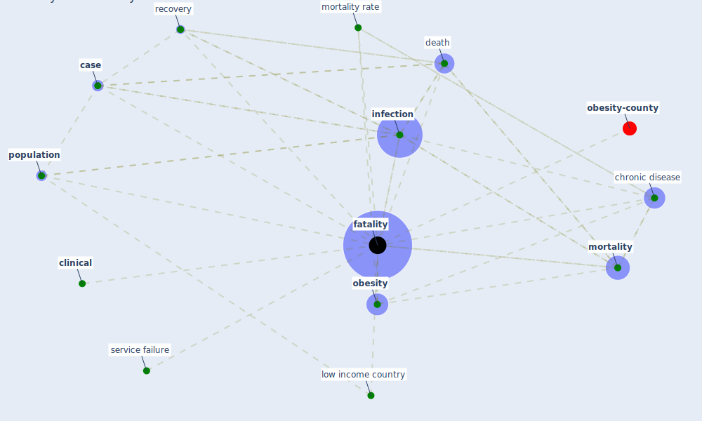

# Keyword: fatality

* [obesity-county](cluster_9)

## Keywords

 * Cluster_9, [case](keyword_case), [chronic disease](keyword_chronic_disease), [clinical](keyword_clinical), death, fatalities, [fatality](keyword_fatality), [infection](keyword_infection), low income country, [mortality](keyword_mortality), mortality rate, [obesity](keyword_obesity), [population](keyword_population), [recovery](keyword_recovery), service failure

## Mapping

## Neighbours

### Closest articles

* COVID-19 Higher Mortality in Chinese Regions With Chronic Exposure to Lower Air Quality - [LINK](article_pansini_covid-19_2021)
* Treating two pandemics for the price of one: Chronic and infectious disease impacts of the built and natural environment - [LINK](article_frank_treating_2021)
* The changes in the effects of social media use of Cypriots due to COVID-19 pandemic - [LINK](article_kaya_changes_2020)
* COVID-19: Risk assessment and mitigation measures in healthcare and non-healthcare workplaces - [LINK](article_fawzy_covid-19_2021)
* Contextualizing the Covid-19 pandemic for a carbon-constrained world: Insights for sustainability transitions, energy justice, and research methodology - [LINK](article_sovacool_contextualizing_2020)
* Impact of Covid-19 on the built environment - [LINK](article_mahima_impact_2022)
* DeepSOCIAL: Social Distancing Monitoring and Infection Risk Assessment in COVID-19 Pandemic - [LINK](article_rezaei_deepsocial_2020)
* Urban planning after COVID-19 - [LINK](article_rtpi_urban_2021)
* Blockchain technology and its applications to combat COVID-19 pandemic - [LINK](article_sharma_blockchain_2022)

### Closest BPs

