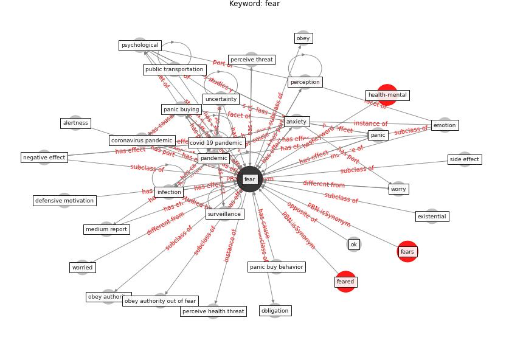

# Keyword: fear

* [gbn-mental](cluster_Cluster_0)

## Keywords

 * Cluster_0, alertness, alertness to potential risk, anticipatory anxiety, [anxiety](keyword_anxiety), authority, cfqcmc, collector, communal, [coronavirus](keyword_coronavirus), coronavirus pandemic, [covid 19 pandemic](keyword_covid_19_pandemic), covid 19 virus, defensive motivation, emotion, emotional response, existential, [fear](keyword_fear), fear of becoming infect, fear of insufficient disinfection, feared, fears, forehead mi yes, functional role, h1n1 flu, housing insecurity, hygienic regime, [infection](keyword_infection), information security, invert ushaped drive function, [knowledge](keyword_knowledge), medium report, mi yes, moderate, negative effect, negative feeling, obey, obey authority, obey authority out of fear, obligation, [ok](keyword_ok), [pandemic](keyword_pandemic), panic, panic buy behavior, panic buying, perceive efficacy, perceive health threat, perceive health threat of the coronavirus, [perceive risk](keyword_perceive_risk), perceive threat, perception, phobia, [psychological](keyword_psychological), psychological disorder, [psychological health](keyword_psychological_health), psychological tension, public health concern, public transportation, side effect, [surveillance](keyword_surveillance), uncertainty, worried, worry

## Concepts

 

## Neighbours

### Closest articles

* How COVID-19 Could Accelerate the Adoption of New Retail Technologies and Enhance the (E-)Servicescape - [LINK](article_willems_how_2021)
* Association between indoor-outdoor green features and psychological health during the COVID-19 lockdown in Italy: A cross-sectional nationwide study - [LINK](article_spano_association_2021)
* Management of the COVID-19 pandemic: challenges, practices, and organizational support - [LINK](article_hossny_management_2022)
* The impacts of knowledge, risk perception, emotion and information on citizens’ protective behaviors during the outbreak of COVID-19: a cross-sectional study in China - [LINK](article_ning_impacts_2020)
* Compliance with COVID-19 Mitigation Measures in the United States - [LINK](article_van_rooij_compliance_2020)
* What drives unverified information sharing and cyberchondria during the COVID-19 pandemic? - [LINK](article_laato_what_2020)
* Should I Stay or Should I Go? Tourists’ COVID-19 Risk Perception and Vacation Behavior Shift - [LINK](article_bratic_should_2021)
* Pandemic stricken cities on lockdown. Where are our planning and design professionals [now, then and into the future]? - [LINK](article_allam_pandemic_2020)
* Impacts of COVID-19 on Health and Safety of Workforce in Construction Industry - [LINK](article_pamidimukkala_impacts_2021)

### Closest BPs

