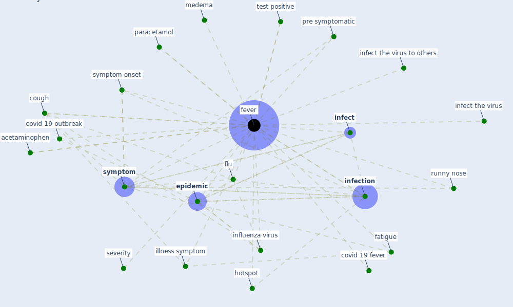

# Keyword: fever

## Keywords

 * acetaminophen, cough, covid 19 fever, covid 19 outbreak, [epidemic](keyword_epidemic), fatigue, [fever](keyword_fever), fevers, flu, hotspot, illness symptom, [infect](keyword_infect), infect the virus, infect the virus to others, [infection](keyword_infection), [influenza virus](keyword_influenza_virus), medema, [paracetamol](keyword_paracetamol), pre symptomatic, runny nose, severity, [symptom](keyword_symptom), symptom onset, test positive

## Mapping

## Neighbours

### Closest articles

*  - [LINK](article_mehtab_alam_role_2021)
* Infodemic and the spread of fake news in the COVID-19-era - [LINK](article_orso_infodemic_2020)
* The impacts of knowledge, risk perception, emotion and information on citizens’ protective behaviors during the outbreak of COVID-19: a cross-sectional study in China - [LINK](article_ning_impacts_2020)
* COVID-19 Pandemic: Prevention and Protection Measures to Be Adopted at the Workplace - [LINK](article_cirrincione_covid-19_2020)
* Graphene-based nanomaterials as antimicrobial surface coatings: A parallel approach to restrain the expansion of COVID-19 - [LINK](article_ayub_graphene-based_2021)
* Recently employed engineering techniques to reduce the spread of COVID-19 (corona virus disease 2019): a review study - [LINK](article_saman_recently_2021)
* Response to COVID-19 in Taiwan - [LINK](article_wang_response_2020)
* Knowledge, attitudes, and practices of Indonesian residents regarding COVID-19: A national cross-sectional survey - [LINK](article_yodang_knowledge_2021)
* Towards the sustainable development of smart cities through mass video surveillance: A response to the COVID-19 pandemic - [LINK](article_shorfuzzaman_towards_2021)
* Contributions of Smart City Solutions and Technologies to Resilience against the COVID-19 Pandemic: A Literature Review - [LINK](article_sharifi_contributions_2021)

### Closest BPs

