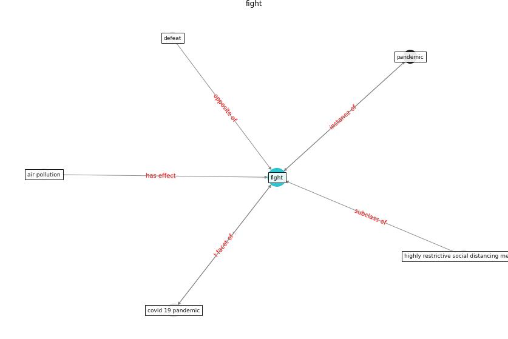

# Keyword: __fight__
## Clusters

* Cluster 14: [surveying-drone](cluster_14)

## Concepts

 

## Articles
* Internet of things (IoT) applications to fight against
COVID-19 pandemic ([singh_internet_2020](article_singh_internet_2020))
* realdania_refleksioner_2022_EN-2550 ([realdania_refleksioner_2022_EN-2550](article_realdania_refleksioner_2022_EN-2550))
* Significant applications of virtual reality for COVID-19
pandemic ([singh_significant_2020](article_singh_significant_2020))
* Significant applications of virtual reality for COVID-19
pandemic ([singh_significant_2020](article_singh_significant_2020))
* Characterization and performance evaluation of a
full-scale activated carbon-based dynamic botanical air
filtration system for improving indoor air quality ([wang_characterization_2011](article_wang_characterization_2011))
* COVID-ABS: An agent-based model of COVID-19
epidemic to simulate health and economic effects of social
distancing interventions ([silva_covid-abs_2020](article_silva_covid-abs_2020))
* A Comprehensive Review of the COVID-19 Pandemic
and the Role of IoT, Drones, AI, Blockchain, and
5G in Managing its Impact ([chamola_comprehensive_2020](article_chamola_comprehensive_2020))
* Assessment method for new sustainability indicators
providing pandemic resilience for residential buildings ([tokazhanov_assessment_2021](article_tokazhanov_assessment_2021))
* realdania_refleksioner_2022_EN-1950 ([realdania_refleksioner_2022_EN-1950](article_realdania_refleksioner_2022_EN-1950))
* realdania_refleksioner_2022_EN-100 ([realdania_refleksioner_2022_EN-100](article_realdania_refleksioner_2022_EN-100))
