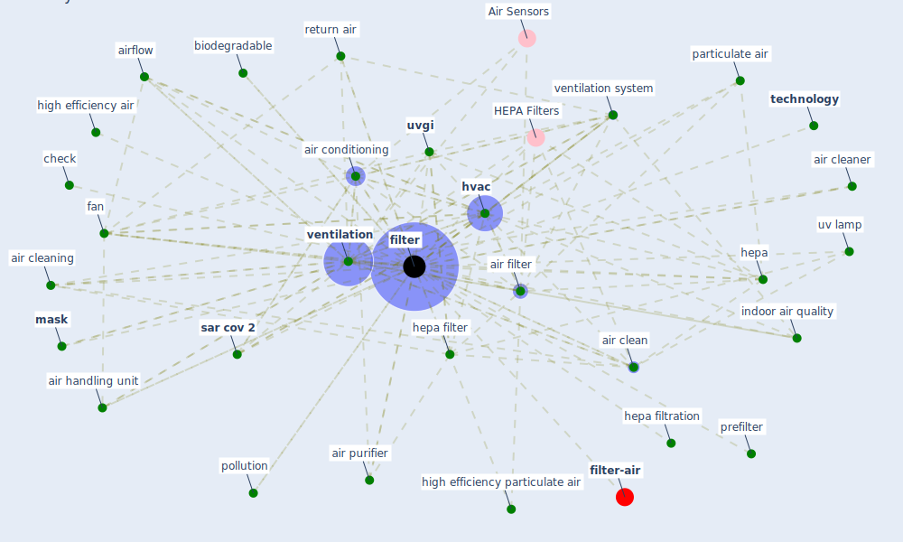

# Keyword: filter

* [filter-air](cluster_0)

## Keywords

 * 100 outdoor air, HEPA Filters, absorption, absorption of gas, [air](keyword_air), air 49, air clean, air cleaner, air cleaning, [air conditioning](keyword_air_conditioning), [air filter](keyword_air_filter), air handling, air handling system, air handling unit, air hepa filter, air purifier, air purify, air purify system, airborne transmission, airflow, barrier to air passage, biodegradable, blue treat, change filter, check, check system, cleaner, diffuser, disinfection equipment, dna extraction, efficiency reporting value, end expiratory pressure valve, equipment, fan, fan coil return filter, [filter](keyword_filter), filter capacity, filter regularly, filtered, filtering, frequency, fuse filament fabrication, hepa, hepa filter, hepa filtration, high efficiency air, high efficiency particulate air, [hvac](keyword_hvac), [hvac system](keyword_hvac_system), [iaq](keyword_iaq), [indoor air quality](keyword_indoor_air_quality), maintain as usual, maintain filter, maintain filter as usual, [mask](keyword_mask), merv, merv 16, mesh, minimum efficiency reporting value, mount frame, n95, no filter system be perfect, outdoor air, [particle](keyword_particle), particulate absorption, particulate air, particulate air hepa filter, [pathogen](keyword_pathogen), photocatalytic oxidation, pollution, pore size, prefiler, prefilter, purification, purify, purify the air, purpose, purpose for which it be utilize, remove they, return air, return air filter, return air operation, [sanitation](keyword_sanitation), [sar cov 2](keyword_sar_cov_2), schedule, schedule for filter change, snood, snood type mask, [system](keyword_system), [technology](keyword_technology), [transmission](keyword_transmission), uv lamp, [uvgi](keyword_uvgi), uvgi clean, ventilate, ventilating system, [ventilation](keyword_ventilation), ventilation system, virus transmission, washable

## Mapping

## Neighbours

### Closest articles

* A critical review of heating, ventilation, and air conditioning (HVAC) systems within the context of a global SARS-CoV-2 epidemic - [LINK](article_elsaid_critical_2021)
* Review and comparison of HVAC operation guidelines in different countries during the COVID-19 pandemic - [LINK](article_guo_review_2021)
* Ventilation use in nonmedical settings during COVID-19: Cleaning protocol, maintenance, and recommendations - [LINK](article_nembhard_ventilation_2020)
* A Review on Building Design as a Biomedical System for Preventing COVID-19 Pandemic - [LINK](article_amran_review_2022)
* A review of facilities management interventions to mitigate respiratory infections in existing buildings - [LINK](article_zhang_review_2022)
* Supporting Technologies for COVID-19 Prevention: Systemized Review - [LINK](article_zhao_supporting_2022)
* The ventilation of buildings and other mitigating measures for COVID-19: a focus on wintertime - [LINK](article_burridge_ventilation_2021)
* Real-world data show that filters clean COVID-causing virus from air - [LINK](article_thompson_real-world_2021)
* COVID-19 Could Leverage a Sustainable Built Environment - [LINK](article_pinheiro_covid-19_2020)
* Designing Post COVID-19 Buildings: Approaches for Achieving Healthy Buildings - [LINK](article_navaratnam_designing_2022)

### Closest BPs

