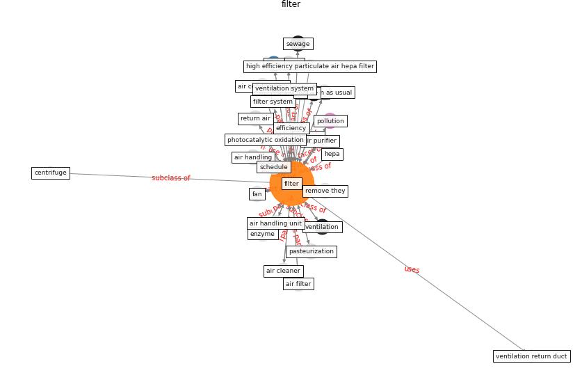

# Keyword: __filter__
## Clusters

* Cluster 2: [air-sars](cluster_2)

## Concepts

 

## Articles
* Review and comparison of HVAC operation guidelines in
different countries during the COVID-19 pandemic ([guo_review_2021](article_guo_review_2021))
* Ventilation use in nonmedical settings during COVID-19:
Cleaning protocol, maintenance, and recommendations ([nembhard_ventilation_2020](article_nembhard_ventilation_2020))
* A Review on Building Design as a Biomedical
System for Preventing COVID-19 Pandemic ([amran_review_2022](article_amran_review_2022))
* A review of facilities management interventions to
mitigate respiratory infections in existing buildings ([zhang_review_2022](article_zhang_review_2022))
* Supporting Technologies for COVID-19 Prevention:
Systemized Review ([zhao_supporting_2022](article_zhao_supporting_2022))
* 2019 Novel Coronavirus (COVID-19) Pandemic:
Built Environment Considerations To Reduce
Transmission ([dietz_2019_2020](article_dietz_2019_2020))
* The ventilation of buildings and other mitigating measures
for COVID-19: a focus on wintertime ([burridge_ventilation_2021](article_burridge_ventilation_2021))
* Real-world data show that filters clean COVID-causing
virus from air ([thompson_real-world_2021](article_thompson_real-world_2021))
* Designing Post COVID-19 Buildings: Approaches for
Achieving Healthy Buildings ([navaratnam_designing_2022](article_navaratnam_designing_2022))
* COVID-19 Could Leverage a Sustainable Built
Environment ([pinheiro_covid-19_2020](article_pinheiro_covid-19_2020))
