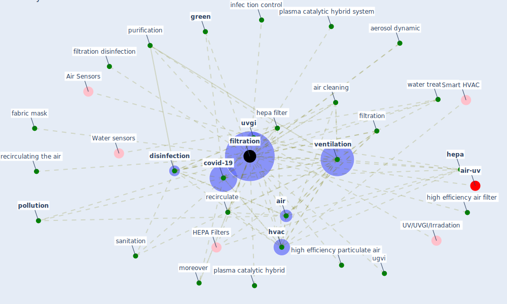

# Keyword: filtration

* [air-uv](cluster_10)

## Keywords

 * Cluster_10, HEPA Filters, activate carbon filter, aerosol concentration, aerosol dynamic, [air](keyword_air), air cleaning, ceiling mount, chlorination, [clean](keyword_clean), [control](keyword_control), control the pathogen level, covid 19 transmission, [covid-19](keyword_covid-19), dilution, [disinfection](keyword_disinfection), electrostatic air filter, fabric mask, [filtration](keyword_filtration), filtration disinfection, [green](keyword_green), [hepa](keyword_hepa), hepa filter, high efficiency air filter, high efficiency particulate air, [hvac](keyword_hvac), infec tion control, moreover, plasma catalytic hybrid, plasma catalytic hybrid system, [pollution](keyword_pollution), purification, recirculate, recirculating the air, [sanitation](keyword_sanitation), ugvi, [uvgi](keyword_uvgi), [ventilation](keyword_ventilation), water treatment, filtration, filtration of air

## Mapping

## Neighbours

### Closest articles

* ASHRAE Position Document on Infectious Aerosols - [LINK](article_ashrae_ashrae_2022)
* Indoor Air Quality: Rethinking rules of building design strategies in post-pandemic architecture - [LINK](article_megahed_indoor_2021)
* Prophylactic Architecture: Formulating the Concept of Pandemic-Resilient Homes - [LINK](article_elrayies_prophylactic_2022)
* Ten questions concerning occupant health in buildings during normal operations and extreme events including the COVID-19 pandemic - [LINK](article_awada_ten_2021)
* Environmental factors involved in SARS-CoV-2 transmission: effect and role of indoor environmental quality in the strategy for COVID-19 infection control - [LINK](article_azuma_environmental_2020)
* Ventilation use in nonmedical settings during COVID-19: Cleaning protocol, maintenance, and recommendations - [LINK](article_nembhard_ventilation_2020)
* Applications of ultraviolet germicidal irradiation disinfection in health care facilities: Effective adjunct, but not stand-alone technology - [LINK](article_memarzadeh_applications_2010)
* Methods for air cleaning and protection of building occupants from airborne pathogens - [LINK](article_bolashikov_methods_2009)
* The Role of Architecture and Urbanism in Preventing Pandemics - [LINK](article_kumar_role_2021)
* A Review on Building Design as a Biomedical System for Preventing COVID-19 Pandemic - [LINK](article_amran_review_2022)

### Closest BPs

