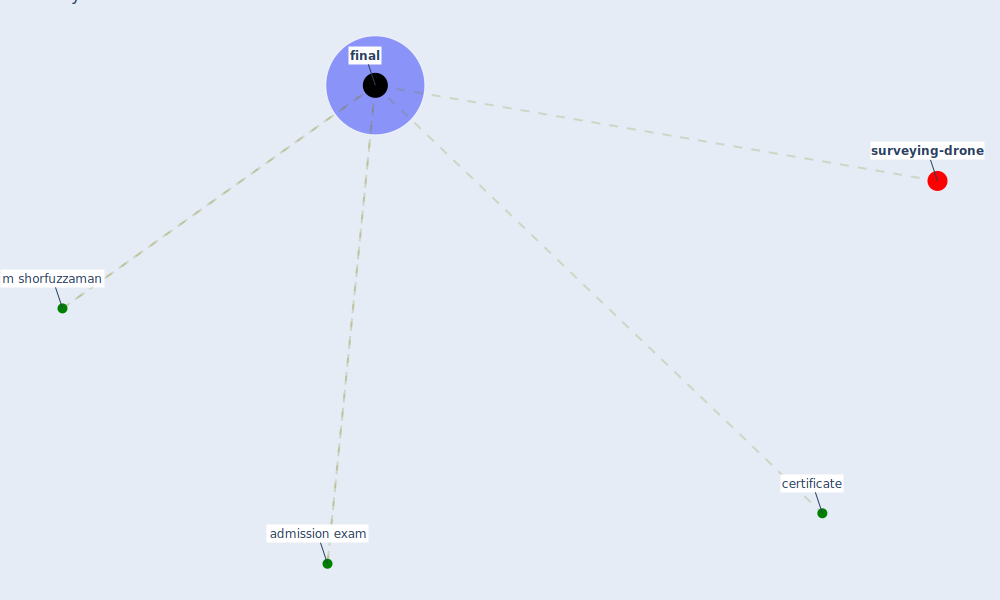

# Keyword: final

* [surveying-drone](cluster_13)

## Keywords

 * Cluster_13, admission exam, certificate, [final](keyword_final), m shorfuzzaman

## Mapping

## Neighbours

### Closest articles

* Towards the sustainable development of smart cities through mass video surveillance: A response to the COVID-19 pandemic - [LINK](article_shorfuzzaman_towards_2021)
* What has been the impact of the COVID-19 pandemic on immigrants? An update on recent evidence - [LINK](article_oecd_what_2022)
* COVID-19 Bulletin 1: Alterations to BREEAM assessment requirements as a result of the Coronavirus pandemic – Knowledge Base - [LINK](article_breeam_covid-19_2020)

### Closest BPs

