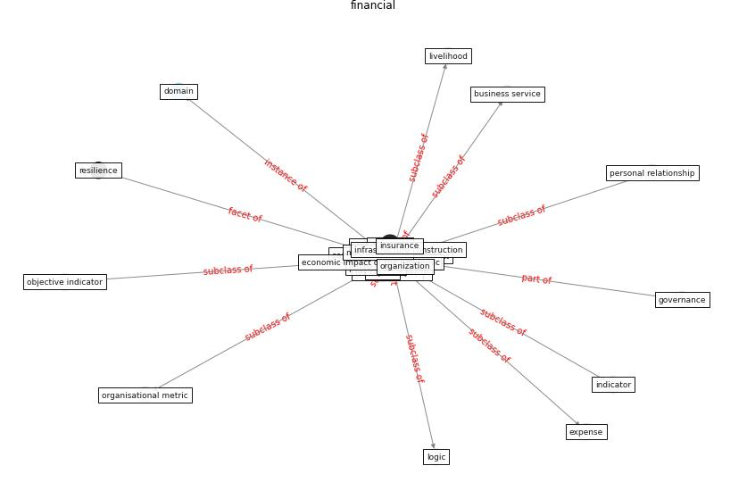

# Keyword: __financial__
## Clusters

* Cluster 9: [resilience-infrastructure](cluster_9.md)

## Concepts

 

## Articles
* world_bank_world_2022-150 ([world_bank_world_2022-150](article_world_bank_world_2022-150.md))
* Global value chains: Efficiency and risks in the context
of COVID-19 ([oecd_global_2021](article_oecd_global_2021.md))
* Mechanisms for addressing the impact of COVID-19 on
infrastructure projects ([king_mechanisms_2021](article_king_mechanisms_2021.md))
* How Can Blockchain Help People in the Event of
Pandemics Such as the COVID-19? ([chang_how_2020](article_chang_how_2020.md))
* world_bank_world_2022-100 ([world_bank_world_2022-100](article_world_bank_world_2022-100.md))
* The City Under COVID‐19: Podcasting As
Digital Methodology ([rogers_city_2020](article_rogers_city_2020.md))
* Current knowledge of COVID-19: Advances, challenges
and future perspectives ([wu_current_2021](article_wu_current_2021.md))
* Occupant health in buildings: Impact of the COVID-19
pandemic on the opinions of building professionals and
implications on research ([awada_occupant_2022](article_awada_occupant_2022.md))
* world_green_building_council_health_2014-150 ([world_green_building_council_health_2014-150](article_world_green_building_council_health_2014-150.md))
* martin_impact_2008-200 ([martin_impact_2008-200](article_martin_impact_2008-200.md))
