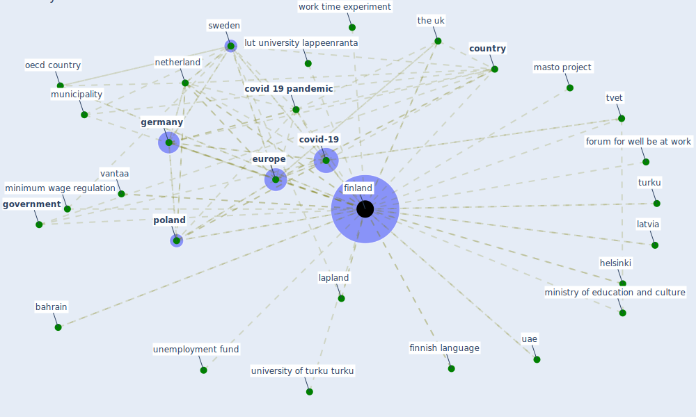

# Keyword: finland

## Keywords

 * age plan, average compensation level, bahrain, bank of finland, belgium, box 6, building practice, change security programme, [country](keyword_country), country strict, [covid 19 crisis](keyword_covid_19_crisis), [covid 19 pandemic](keyword_covid_19_pandemic), [covid-19](keyword_covid-19), education and culture, employment contract act 2001, espoo, estonia, eu member state, euro, [europe](keyword_europe), [finland](keyword_finland), finnish language, finnish tvet, fioh, food and agriculture organization of the united nations, forum for well be at work, foundation, [germany](keyword_germany), [government](keyword_government), great helsinki, [health care](keyword_health_care), helsinki, helsinki area, helsinki university of technology, home care allowance, internationalconference on human choice and computers, isiaq, job cycle, job cycle model, karvala, kraków, lapland, latvia, lut university lappeenranta, many other country, masto, masto project, minimum wage regulation, ministry of education and culture, municipality, [netherland](keyword_netherland), nondiscrimination act, nondiscrimination act in finland, number of case in finland, [oecd](keyword_oecd), oecd country, paimio sanatorium, [pandemic](keyword_pandemic), people with reduce work capacity at work programme 2013 2015, [poland](keyword_poland), reijula, sandvik, sickness absence monitor, sickness absence monitoring in finland, similar scheme, state of emergency, study leave, sustainable work policy, [sweden](keyword_sweden), symptom checker, the number of case in finland remain at a low level than in many other country, the uk, trade union, trade union of education, trade union of education in finland, turku, [tvet](keyword_tvet), tvet learning, tvet learning in finland, tvet study year, tvet system in finland, uae, unemployment allowance, unemployment fund, university of applied science, university of helsinki, university of turku turku, unpaid study leave, urban forests, vaisala, vaisala oyj, vantaa, work course model, work life development strategy, work time account, work time act, work time act in finland, work time experiment, worldwide educate for the future index, youth guarantee

## Mapping

## Neighbours

### Closest articles

* Sustainable work throughout the life course: National policies and strategies, Publications Office of the European Union - [LINK](article_eurofund_sustainable_2016)
* Case Study on Finnish TVETA Resilient Model of Training During COVID-19 - [LINK](article_unesco_case_2021)
* The effect of a redesigned floor plan, occupant density and the quality of indoor climate on the cost of space, productivity and sick leave in an office building–A case study - [LINK](article_saari_effect_2006)
* Pandemiens arkitektur - [LINK](article_realdania_pandemiens_2022)
*  - [LINK](article_mehtab_alam_role_2021)
* What drives unverified information sharing and cyberchondria during the COVID-19 pandemic? - [LINK](article_laato_what_2020)
* Effect of Ultraviolet Germicidal Irradiation on Viral Aerosols - [LINK](article_walker_effect_2007)
* Mental health economics: A prospective study on psychological flourishing and associations with healthcare costs and sickness benefit transfers in Denmark - [LINK](article_santini_mental_2021)
* Health, Wellbeing \& Productivity in Offices - [LINK](article_world_green_building_council_health_2014)
* 2020 Data Protection Report - [LINK](article_council_of_europe_2020_2020)

### Closest BPs

