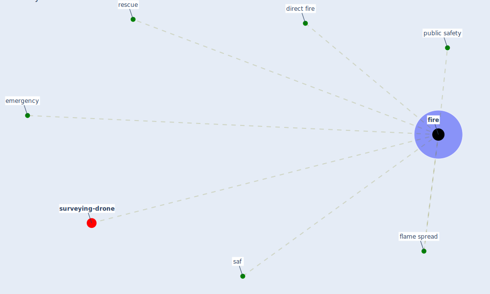

# Keyword: fire

* [surveying-drone](cluster_13)

## Keywords

 * Cluster_13, direct fire, emergency, [fire](keyword_fire), fires, flame spread, public safety, rescue, saf

## Mapping

## Neighbours

### Closest articles

* How will COVID-19 change future building regulations? - [LINK](article_hmc_architects_how_2020)
* Wastewater surveillance for population-wide Covid-19: The present and future - [LINK](article_daughton_wastewater_2020)
* COVID-19 Could Leverage a Sustainable Built Environment - [LINK](article_pinheiro_covid-19_2020)
* EXPOSED: An occupant exposure model for confined spaces to retrofit crowd models during a pandemic - [LINK](article_ronchi_exposed_2020)
* How COVID-19 Could Accelerate the Adoption of New Retail Technologies and Enhance the (E-)Servicescape - [LINK](article_willems_how_2021)

### Closest BPs

