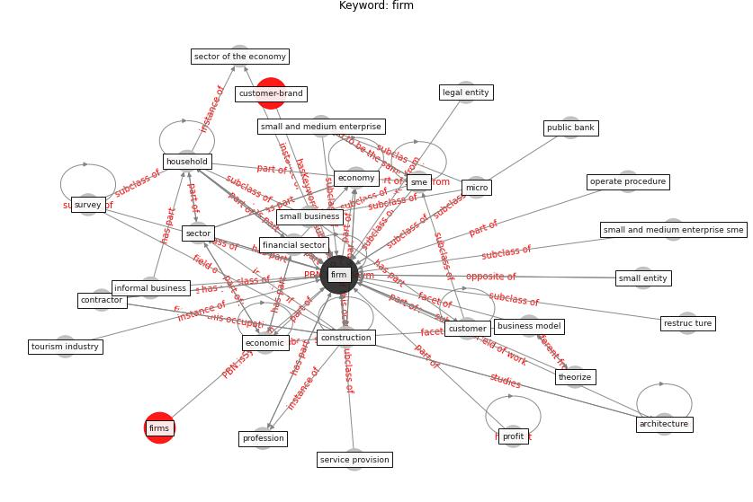

# Keyword: firm

* [customer-brand](cluster_Cluster_8)

## Keywords

 * Cluster_8, [architecture](keyword_architecture), [bank](keyword_bank), [business](keyword_business), business model, [construction](keyword_construction), [contractor](keyword_contractor), creative tinkering, [customer](keyword_customer), e payment, [economic](keyword_economic), economic gain, [economy](keyword_economy), financial sector, [firm](keyword_firm), firms, food service, [household](keyword_household), informal, informal business, legal entity, micro, netflix, operate procedure, paceman, [people](keyword_people), private company, profession, profit, public bank, restruc ture, sector, sector of the economy, service provision, small and medium enterprise, small and medium enterprise sme, small business, small entity, [sme](keyword_sme), [survey](keyword_survey), theorize, tourism industry, ture

## Concepts

 

## Neighbours

### Closest articles

* World Bank Development Report - [LINK](article_world_bank_world_2022)
* How COVID-19 Could Accelerate the Adoption of New Retail Technologies and Enhance the (E-)Servicescape - [LINK](article_willems_how_2021)
* Guidelines for Responding to COVID-19 Pandemic: Best Practices, Impacts, and Future Research Directions - [LINK](article_assaad_guidelines_2021)
* Mechanisms for addressing the impact of COVID-19 on infrastructure projects - [LINK](article_king_mechanisms_2021)
* Propositions for a Resilient, Post-COVID-19 Future for the AEC Industry - [LINK](article_nassereddine_propositions_2021)
* It’s time to reimagine where and how work will get done (PwC’s US Remote Work Survey) - [LINK](article_pricewaterhousecoopers_its_2021)
* Global value chains: Efficiency and risks in the context of COVID-19 - [LINK](article_oecd_global_2021)
* The Effects of Pandemic on Construction Industry in the UK - [LINK](article_shibani_effects_2020)
* Impacts of COVID-19 on Health and Safety of Workforce in Construction Industry - [LINK](article_pamidimukkala_impacts_2021)

### Closest BPs

