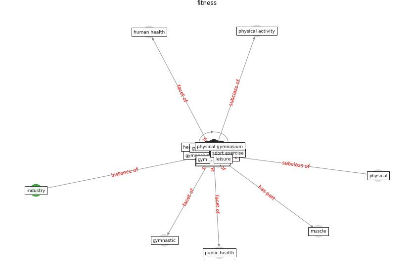

# Keyword: fitness

* [mental-health](cluster_Cluster_11)

## Keywords

 * Cluster_11, aerobic, dyrker fitness, [fitness](keyword_fitness), [gym](keyword_gym), gymnasium, gymnastic, gymnastik, [health](keyword_health), health and fitness club, [health club](keyword_health_club), [human health](keyword_human_health), [industry](keyword_industry), leisure, muscle, [physical](keyword_physical), physical activity, physical gymnasium, [public health](keyword_public_health), [sar cov 2](keyword_sar_cov_2), sport, sport exercise, the gym, weightlift, yoga

## Concepts

 

## Neighbours

### Closest articles

* Assessment of COVID-19 precautionary measures in sports facilities: A case study on a health club in Saudi Arabia - [LINK](article_ibrahim_assessment_2022)
* Refleksioner fra en pandemi - [LINK](article_realdania_refleksioner_2022)
* Health, Wellbeing \& Productivity in Offices - [LINK](article_world_green_building_council_health_2014)
* How Covid-19 Has Permanently Changed the Fitness Industry - [LINK](article_davalos_how_2021)
* Assessment method for new sustainability indicators providing pandemic resilience for residential buildings - [LINK](article_tokazhanov_assessment_2021)
* How COVID-19 Could Accelerate the Adoption of New Retail Technologies and Enhance the (E-)Servicescape - [LINK](article_willems_how_2021)
* Home garden use during COVID-19: Associations with physical and mental wellbeing in older adults - [LINK](article_corley_home_2021)
* Designing Post COVID-19 Buildings: Approaches for Achieving Healthy Buildings - [LINK](article_navaratnam_designing_2022)

### Closest BPs

