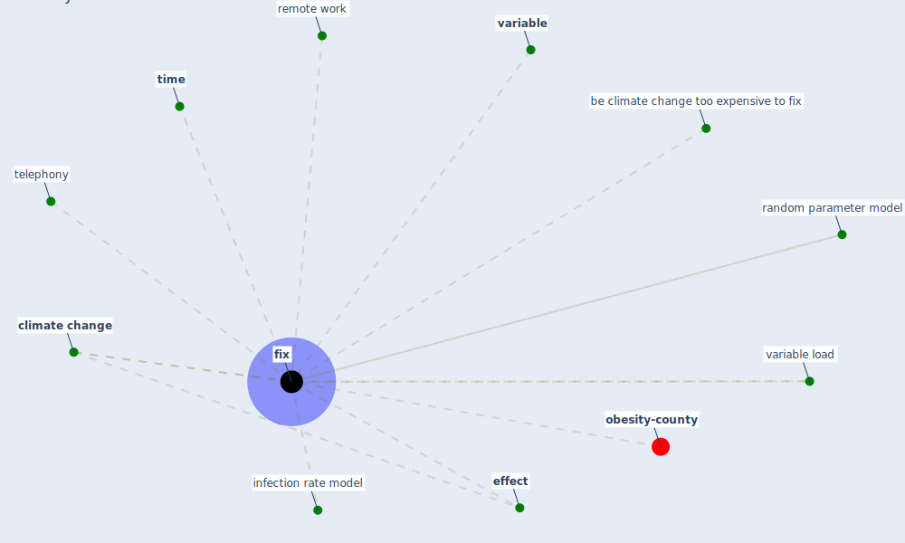

# Keyword: fix

* [obesity-county](cluster_9)

## Keywords

 * Cluster_9, be climate change too expensive to fix, [climate change](keyword_climate_change), [effect](keyword_effect), [fix](keyword_fix), fixed, infection rate model, random parameter model, [remote work](keyword_remote_work), telephony, [time](keyword_time), [variable](keyword_variable), variable load

## Mapping

## Neighbours

### Closest articles

* The effect of occupant distribution on energy consumption and COVID-19 infection in buildings: A case study of university building - [LINK](article_mokhtari_effect_2021)
* Treating two pandemics for the price of one: Chronic and infectious disease impacts of the built and natural environment - [LINK](article_frank_treating_2021)
* Study of COVID-19 pandemic in London (UK) from urban context - [LINK](article_ghosh_study_2020)
* Coronavirus and Climate Change - [LINK](article_harvard_th_chan_schoold_of_public_health_coronavirus_2020)
* World Bank Development Report - [LINK](article_world_bank_world_2022)
* How the Coronavirus Will Reshape Architecture - [LINK](article_chayka_how_2020)

### Closest BPs

