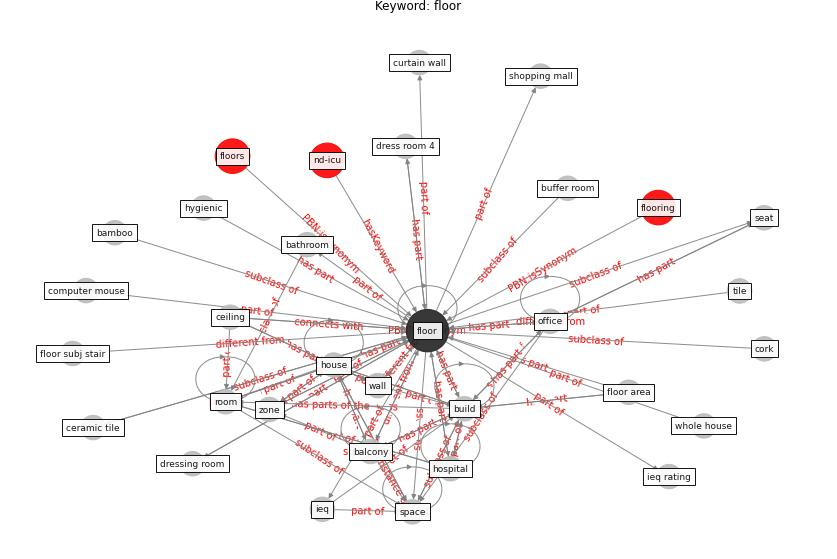

# Keyword: floor

* [nd-icu](cluster_Cluster_0)

## Keywords

 * Cluster_0, [balcony](keyword_balcony), bamboo, bathroom, buffer room, [build](keyword_build), ceiling, ceramic tile, computer mouse, cork, curtain wall, dress room 4, dressing room, engineer timber, finish material, fix wall, fix wall floor, [floor](keyword_floor), floor area, floor subj stair, flooring, floors, [hospital](keyword_hospital), [house](keyword_house), hygienic, [ieq](keyword_ieq), ieq rating, [office](keyword_office), [room](keyword_room), seat, shopping mall, [space](keyword_space), tile, wall, whole house, zone

## Concepts

 

## Neighbours

### Closest articles

* Continuous IEQ monitoring system: Context and development - [LINK](article_parkinson_continuous_2019)
* Designing Post COVID-19 Buildings: Approaches for Achieving Healthy Buildings - [LINK](article_navaratnam_designing_2022)
* Aerosol and Surface Distribution of Severe Acute Respiratory Syndrome Coronavirus 2 in Hospital Wards, Wuhan, China, 2020 - [LINK](article_guo_aerosol_2020)
* Health, Wellbeing \& Productivity in Offices - [LINK](article_world_green_building_council_health_2014)
* An Intelligent IEQ Monitoring and Feedback System: Development and Applications - [LINK](article_geng_intelligent_2021)
* A review of facilities management interventions to mitigate respiratory infections in existing buildings - [LINK](article_zhang_review_2022)
* Assessment of COVID-19 precautionary measures in sports facilities: A case study on a health club in Saudi Arabia - [LINK](article_ibrahim_assessment_2022)
* Toilets dominate environmental detection of SARS-CoV-2 virus in a hospital - [LINK](article_ding_toilets_2020)
* Review and comparison of HVAC operation guidelines in different countries during the COVID-19 pandemic - [LINK](article_guo_review_2021)
* The Effect of Opening Windows on Air Change Rates in Two Homes - [LINK](article_howard-reed_effect_2002)

### Closest BPs

