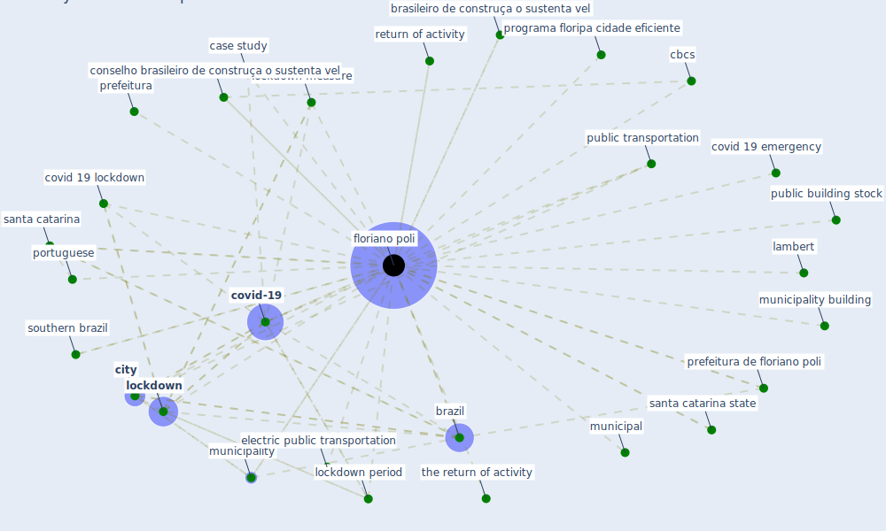

# Keyword: floriano poli

## Keywords

 * brasileiro de construça o sustenta vel, [brazil](keyword_brazil), case study, cbcs, [city](keyword_city), conselho brasileiro de construça o sustenta vel, covid 19 emergency, covid 19 lockdown, [covid-19](keyword_covid-19), electric public transportation, [floriano poli](keyword_floriano_poli), floriano polis, lambert, [lockdown](keyword_lockdown), lockdown measure, lockdown period, municipal, municipality, municipality building, portuguese, prefeitura, prefeitura de floriano poli, programa floripa cidade eficiente, public building stock, public transportation, return of activity, santa catarina, santa catarina state, southern brazil, the return of activity

## Mapping

## Neighbours

### Closest articles

* Addressing the impact of COVID-19 lockdown on energy use in municipal buildings: A case study in Florianópolis, Brazil - [LINK](article_geraldi_addressing_2021)

### Closest BPs

