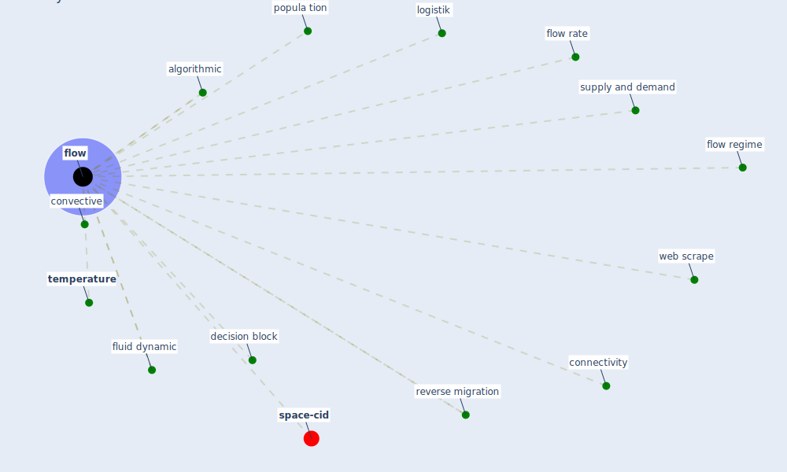

# Keyword: flow

* [space-cid](cluster_2)

## Keywords

 * Cluster_2, algorithmic, connectivity, convective, decision block, [flow](keyword_flow), flow rate, flow regime, flows, fluid dynamic, logistik, popula tion, reverse migration, supply and demand, [temperature](keyword_temperature), [web scrape](keyword_web_scrape)

## Mapping

## Neighbours

### Closest articles

* The ventilation of buildings and other mitigating measures for COVID-19: a focus on wintertime - [LINK](article_burridge_ventilation_2021)
* Pandemiens arkitektur - [LINK](article_realdania_pandemiens_2022)
* Urban planning after COVID-19 - [LINK](article_rtpi_urban_2021)
* Continuous IEQ monitoring system: Context and development - [LINK](article_parkinson_continuous_2019)
* Towards the sustainable development of smart cities through mass video surveillance: A response to the COVID-19 pandemic - [LINK](article_shorfuzzaman_towards_2021)
* Integrating rapid risk mapping and mobile phone call record data for strategic malaria elimination planning - [LINK](article_tatem_integrating_2014)
* Association of built environment attributes with the spread of COVID-19 at its initial stage in China - [LINK](article_li_association_2021)
* Risk Diagnosis and Mitigation System of COVID-19 Using Expert System and Web Scraping - [LINK](article_mufid_risk_2020)
* Assessment of Building Automation and Control Systems in Danish Healthcare Facilities in the COVID-19 Era - [LINK](article_pedersen_assessment_2022)

### Closest BPs

