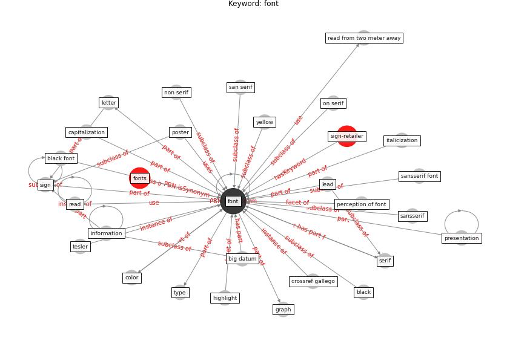

# Keyword: font

* [sign-retailer](cluster_Cluster_8)

## Keywords

 * Cluster_8, [big datum](keyword_big_datum), black, black font, capitalization, color, crossref gallego, [font](keyword_font), fonts, graph, highlight, [information](keyword_information), italicization, lead, letter, non serif, on serif, perception of font, poster, presentation, read, read from two meter away, san serif, sansserif, sansserif font, serif, [sign](keyword_sign), tesler, type, yellow, yellow color

## Concepts

 

## Neighbours

### Closest articles

* Retail Signage During the COVID-19 Pandemic - [LINK](article_mcneish_retail_2020)
* Exploring the Non-Medical impacts of Covid-19 using Natural Language Processing - [LINK](article_agade_exploring_2020)
* Should I Stay or Should I Go? Tourists’ COVID-19 Risk Perception and Vacation Behavior Shift - [LINK](article_bratic_should_2021)
* Architectural design strategies for infection prevention and control (IPC) in health-care facilities: towards curbing the spread of Covid-19 \textbar SpringerLink - [LINK](article_udomiaye_architectural_2020)

### Closest BPs

