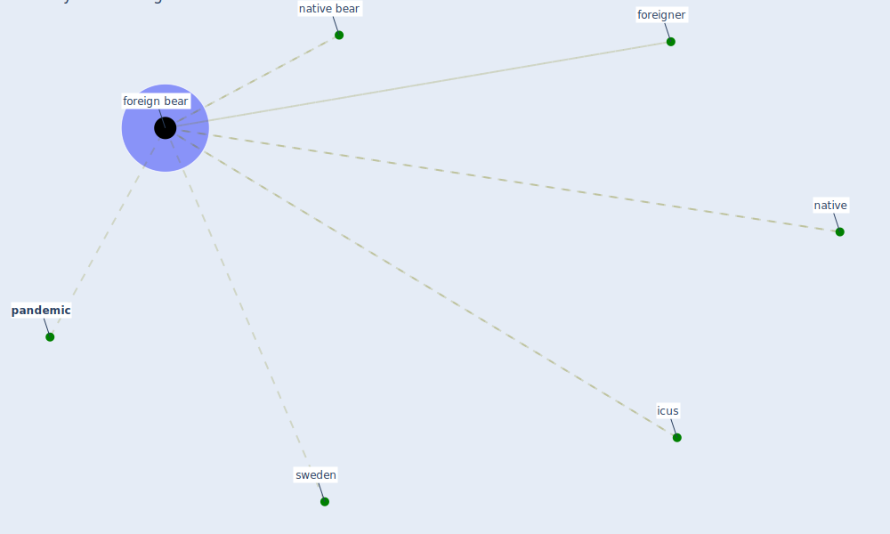

# Keyword: foreign bear

## Keywords

 * [foreign bear](keyword_foreign_bear), foreign born, foreigner, icus, native, [native bear](keyword_native_bear), [pandemic](keyword_pandemic), [sweden](keyword_sweden)

## Mapping

## Neighbours

### Closest articles

* What has been the impact of the COVID-19 pandemic on immigrants? An update on recent evidence - [LINK](article_oecd_what_2022)

### Closest BPs

