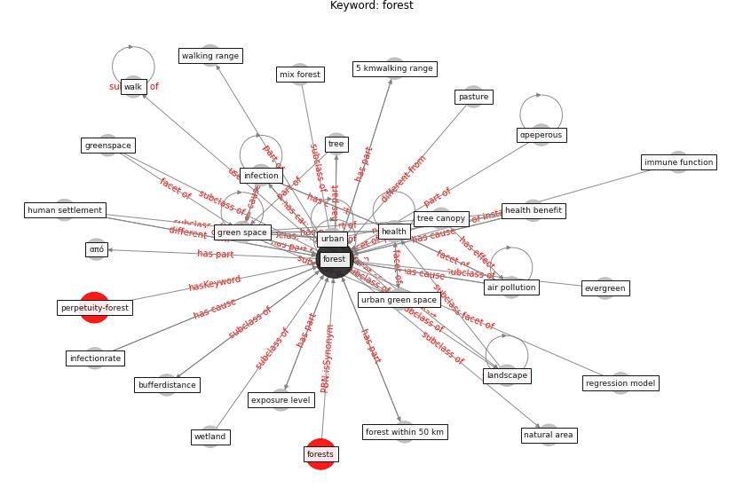

# Keyword: forest

* [perpetuity-forest](cluster_Cluster_6)

## Keywords

 * 5 km walking range, 5 kmwalking range, Cluster_6, [air pollution](keyword_air_pollution), biome, bufferdistance, ecosystem, evergreen, exposure level, [forest](keyword_forest), forest bufferdistance, forest within 50 km, forests, frederiksberg, grassland, green area, green space, greenhouse, greenhousespace, greenpace, greenspace, [health](keyword_health), health benefit, human settlement, immune function, [infection](keyword_infection), infectionrate, land, landscape, mix forest, natural area, park, pasture, regression model, tree, tree canopy, [urban](keyword_urban), urban forest, [urban green space](keyword_urban_green_space), urbanicity, vegetation, walk, walking range, wetland, αpeperous, από

## Concepts

 

## Neighbours

### Closest articles

* Green spaces, especially forest, linked to lower SARS-CoV-2 infection rates: A one-year nationwide study - [LINK](article_jiang_green_2021)
* The impact of the COVID-19 pandemic on the importance of urban green spaces to the public - [LINK](article_noszczyk_impact_2022)
* Prophylactic Architecture: Formulating the Concept of Pandemic-Resilient Homes - [LINK](article_elrayies_prophylactic_2022)
* COVID-19 and a new resilient infrastructure landscape - [LINK](article_oecd_covid-19_2021)
* Ten questions concerning occupant health in buildings during normal operations and extreme events including the COVID-19 pandemic - [LINK](article_awada_ten_2021)
* The Effect of Opening Windows on Air Change Rates in Two Homes - [LINK](article_howard-reed_effect_2002)
* Effects of the COVID-19 pandemic on the use and perceptions of urban green space: An international exploratory study - [LINK](article_ugolini_effects_2020)
* Biophilic design in architecture and its contributions to health, well-being, and sustainability: A critical review - [LINK](article_zhong_biophilic_2022)

### Closest BPs

